# Peter 3.0 — Features & Technical Architecture

This document has two parts:

1. **What Peter 3.0 can actually do** — the feature set, grouped by capability.
2. **How it is built** — a detailed walkthrough of every subsystem ("agent" /
   layer), with a Mermaid diagram and a plain-English explanation for each.

If you only read one section, read Part 2 → *"One turn, end to end"* — it
explains the single most important design decision in the codebase.

---

## Part 1 — Feature List

### 1.1 Feature map

A top-down tree with 10 wide branches squeezes every leaf onto one band and
shrinks past legibility. Laid out left-to-right instead, with each category
in its own panel, the same content reads top-to-bottom in natural,
scrollable groups:

```mermaid
flowchart LR
    P(("Peter 3.0"))

    subgraph SG_V["Voice"]
        direction TB
        V1["Wake word: 'Hey Peter'"]
        V2["Speech-to-text, local, offline"]
        V3["Text-to-speech, sentence-streamed"]
        V4["Barge-in: interrupt Peter mid-sentence"]
        V5["--text mode: type instead of speak"]
    end

    subgraph SG_S["System Control"]
        direction TB
        S1["Open apps / URLs"]
        S2["Read, write, move, delete, search files"]
        S3["Screenshot, clipboard, volume"]
        S4["System stats: CPU / RAM / disk / battery"]
        S5["Lock workstation"]
        S6["Run PowerShell — the full-access escape hatch"]
    end

    subgraph SG_T["Time & Tasks"]
        direction TB
        T1["Alarms, timers, reminders"]
        T2["To-do list"]
        T3["Survives restart — jobs persisted in SQLite"]
    end

    subgraph SG_M["Memory"]
        direction TB
        M1["Remembers facts you tell it"]
        M2["Remembers your preferences"]
        M3["Recalls them by keyword search, unprompted"]
        M4["Keeps a rolling log of past conversations"]
    end

    subgraph SG_E["Email"]
        direction TB
        E1["Read / search / count unread"]
        E2["Send"]
        E3["Star, archive, delete, mark read"]
        E4["No Google OAuth needed — plain IMAP/SMTP"]
    end

    subgraph SG_C["Calendar & Tasks"]
        direction TB
        C1["Check today / upcoming events"]
        C2["Create / delete events"]
        C3["Google Tasks: list, add, complete"]
        C4["Morning briefing: mail + calendar + reminders"]
    end

    subgraph SG_B["Browser (sites with no API)"]
        direction TB
        B1["Read any product page: price, name, availability"]
        B2["Click / type / fill forms on your behalf"]
        B3["Log in once, session reused"]
        B4["Hard-blocked from ever clicking 'Buy' / 'Pay'"]
        B5["Per-site rate limiting to avoid bans"]
    end

    subgraph SG_L["Multi-LLM Brain"]
        direction TB
        L1["3 providers: Claude, GPT, Gemini"]
        L2["Switch by voice mid-conversation"]
        L3["Live running-cost meter, per session — shown in ₹"]
        L4["Per-provider model choice, editable in config.yml"]
        L5["Gemini: smart per-turn routing between a cheap\nand a strong model, based on the turn's own text"]
        L6["Gemini: same-tier fallback on a rate limit / 503,\nno added delay, sticky for the rest of the session"]
        L7["Retry with exponential backoff on any\nrecoverable error, announced as it happens"]
    end

    subgraph SG_G["Safety & Governance"]
        direction TB
        G1["Every action tiered: read / write / spend"]
        G2["A small set of destructive tools still confirm"]
        G3["Spend never auto-executes — hands off to you"]
        G4["Append-only audit log of every tool call"]
    end

    subgraph SG_PR["Proactive"]
        direction TB
        PR1["Meeting-prep nudge: calendar + memory, unprompted"]
        PR2["Inbox digest: what actually needs a reply"]
        PR3["Focus mode: mute, time-box, restore, summarize"]
        PR4["Waiting-on: mail you sent that nobody answered"]
        PR5["Price sweeps and CI failures, announced once each"]
        PR6["Daily work log written into memory"]
    end

    subgraph SG_PH["Phone"]
        direction TB
        PH1["Telegram: ask Peter anything, from anywhere"]
        PH2["Every proactive nudge mirrored to your phone"]
        PH3["Unknown chats get no reply at all"]
        PH4["SMS over ADB: read the one-time code aloud"]
    end

    subgraph SG_EY["Vision"]
        direction TB
        EY1["Look at the screen: 'what is this error?'"]
        EY2["Look at an image file"]
        EY3["Look at the current browser page"]
    end

    subgraph SG_R["Meetings"]
        direction TB
        R1["Record system audio, not just your mic"]
        R2["Transcribed on-device, audio never leaves"]
        R3["Decisions and action items, written to memory"]
    end

    subgraph SG_D["Development"]
        direction TB
        D1["Git status and your commits"]
        D2["Reviews requested of you, across every repo"]
        D3["A build that just broke, announced once"]
        D4["Standup written from real activity"]
    end

    subgraph SG_DOC["Documents"]
        direction TB
        DOC1["Index folders you point at"]
        DOC2["Search passages, free"]
        DOC3["Answers cited back to the file"]
        DOC4["Workspaces: save and reopen what you had open"]
    end

    subgraph SG_CO["Cost"]
        direction TB
        CO1["Every turn's cost kept, per day and per model"]
        CO2["Totalled in rupees, stored in dollars"]
        CO3["Optional daily cap: warn or block"]
    end

    subgraph SG_RT["Routines"]
        direction TB
        RT1["Named chains of Peter's own tools, run as one command"]
        RT2["Defined by hand in config.yml — no confirmation per step"]
        RT3["One failed step reported, the rest still run"]
    end

    subgraph SG_NW["News"]
        direction TB
        NW1["Top headlines, free, no API key"]
        NW2["Search a topic, or general top stories"]
        NW3["Opt-in to the morning briefing"]
    end

    subgraph SG_NT["Notes"]
        direction TB
        NT1["Quick timestamped journal entries"]
        NT2["Full-text search over past notes"]
        NT3["Never injected automatically, only recalled when asked"]
    end

    subgraph SG_PF["Performance"]
        direction TB
        PF1["Every tool call timed: wall / CPU / wait"]
        PF2["Flags tools worth a native rewrite, with evidence"]
        PF3["Zero per-tool code changes needed"]
    end

    subgraph SG_SK["Skills"]
        direction TB
        SK1["Every tool grouped into a named, versioned capability"]
        SK2["--skill-list shows what's usable vs. not configured"]
        SK3["Policy gate still sits above every skill, unchanged"]
    end

    P --> SG_V
    P --> SG_S
    P --> SG_T
    P --> SG_M
    P --> SG_E
    P --> SG_C
    P --> SG_B
    P --> SG_L
    P --> SG_G
    P --> SG_PR
    P --> SG_PH
    P --> SG_EY
    P --> SG_R
    P --> SG_D
    P --> SG_DOC
    P --> SG_CO
    P --> SG_RT
    P --> SG_NW
    P --> SG_NT
    P --> SG_PF
    P --> SG_SK
```

### 1.2 What each area means in practice

| Area | You can say... | What actually happens |
|---|---|---|
| **Voice** | "Hey Peter, what's the weather" | Wake word fires locally → speech is transcribed on-device (faster-whisper) → sent to the LLM → the reply is streamed to TTS sentence-by-sentence, so Peter starts talking before the full answer is even generated. |
| **System control** | "Take a screenshot" / "Open Chrome" / "What's my CPU doing" | Runs directly against Windows via `psutil`, `pywin32`, `pycaw`. `run_powershell` is the deliberate escape hatch for anything not covered by a named tool — always confirmed, always logged. |
| **Time & tasks** | "Remind me to stretch in 20 minutes" | Stored in a SQLite-backed APScheduler job. Survives a restart — kill the process, the reminder still fires later because the job lives on disk, not in memory. |
| **Memory** | "My college is PSG Tech" ... weeks later ... "which college am I in" | Facts and preferences are stored in SQLite with an FTS5 full-text index. Every turn, Peter's memory layer searches your new message for keyword overlap against stored facts and quietly injects the relevant ones — you never have to ask it to "remember to check its memory." |
| **Email** | "Any unread mail from my professor" | Reads over IMAP with an app password — no Google Cloud project, no OAuth, no weekly re-authorization. |
| **Calendar** | "What's on my calendar tomorrow" | Talks to Google Calendar/Tasks via a narrow OAuth client (sensitive, not restricted, scope — see §2.7). |
| **Browser** | "Check the price of this laptop on Flipkart" | No official API exists for that site (see README for the full API survey), so Peter drives a real, logged-in Playwright browser instead. It reads the page's own structured product data first (JSON-LD/OpenGraph — what Google Shopping reads), falling back to a screenshot only if that's absent. |
| **Multi-LLM** | "Switch to Gemini" | The whole conversation's tool-calling loop is vendor-neutral, so switching providers mid-session works without rewriting history — see §2.2.2. When Gemini is set to `auto` (this deployment's default), each turn's own text picks a cheap or a strong model with no extra API call — see §2.2.4. |
| **Safety** | "Delete this file" → Peter asks first, "open Notepad" → just runs | Every one of the 146 registered tools carries a permission tier at registration, but `write` now **defaults to running immediately** — only the handful of genuinely destructive/irreversible tools (delete, send, run a shell command, lock the workstation) are pulled back to confirm via `policy.standing_rules`. `spend`-class actions are not merely "asked about" — the code path to auto-execute them does not exist. See §2.4. |
| **Proactive** | (nothing — that's the point) | "Team meeting in 10 minutes, with Priya and Arjun" fires on its own from a calendar poll. "3 of your 23 unread look like they need a reply" fires from a mail poll. Both are read-only nudges, never actions taken on your behalf — see §2.10. |
| **Phone** | (from Telegram) "what's on my calendar tomorrow" | The same brain, tools, memory and permission gate, reached over the Telegram Bot API — and every proactive nudge mirrored the other way, so a reminder finds you when you are not at the machine. An unknown chat gets *no reply at all*: replying would confirm the bot exists. Anything needing confirmation is declined remotely rather than left hanging on a console prompt nobody is at — see §2.11. |
| **Vision** | "What's this error?" (pointing at the screen) | The screen is captured, downscaled, and actually read by a vision model. `take_screenshot` saved a PNG and stopped; this closes the loop. One isolated call, never left in conversation history — a megapixel image re-sent every turn would be the most expensive mistake available — see §2.14. |
| **Meetings** | "Start recording the sprint planning" | Captures what the *speakers* are playing (WASAPI loopback — i.e. the other people), transcribed on-device with faster-whisper in a background thread, then summarised into decisions and action items and written to memory. The audio never leaves the machine; only the final text is a model call. That stored episode is what lets a meeting-prep nudge say "your last conversation with Priya was about the thresholds" weeks later — see §2.12. |
| **Development** | "What's waiting on me?" / "Write my standup" | `git` and `gh` as subprocesses, so Peter never holds a GitHub token — `gh auth login` already keeps it in the OS keychain. Read-only by design: no commit, push or checkout tool. The standup is assembled from commits, calendar, focus sessions and to-dos, and the model is told to phrase that material and invent nothing — see §2.13. |
| **Documents** | "What did we agree the retry budget was?" | FTS5 over folders you point at, incremental on (size, mtime). `search_docs` is a SQLite query and free; `ask_docs` spends one call to turn the matching passages into an answer cited back to the file, and says so plainly when they do not contain one — see §2.14. |
| **Cost** | "How much have I spent this week?" | Every turn is appended to a ledger, derived by subtracting cumulative counters. Stored in USD (what vendors bill in), displayed in rupees — storing the converted figure would freeze each day's exchange rate into history. An optional daily cap warns or blocks, checked *before* a turn, since that is the only moment it can stop anything — see §2.17. |
| **Expenses & deliveries** | "Scan my bank texts" / "what did I spend on food" / "what's still on the way" | Bank/UPI and courier SMS parsed heuristically into two small ledgers, reusing the same SMS-reading pipeline §2.15 built for OTPs. On-demand only, no background sweep — see §2.18. |
| **Weather** | "What's the weather" / "weather in Mumbai" | Open-Meteo — free, no API key. A city name is geocoded once and cached for the session; folds into the morning briefing when added to `briefing.include` — see §2.18. |
| **Routines** | "Run my good night routine" | A named chain of Peter's own tools, defined by hand in `config.yml` and run as one command with no per-step confirmation — see §2.19. |
| **News** | "What's in the news today" / "news about cricket" | Google News' public RSS feed — free, no API key. Folds into the morning briefing the same way weather does — see §2.19. |
| **Notes** | "Note that the client wants the demo moved to Friday" | A timestamped, full-text-searchable journal, kept deliberately separate from memory's facts and preferences — see §2.19. |
| **Performance** | "How's your performance" | Every tool call timed automatically (wall/CPU/wait), flagging only the rare tool that's genuinely CPU-bound enough to be worth a native rewrite — see §2.20. |
| **Skills** | "What skills do you have" / "do you have GitHub" | Every tool module is grouped into a named, versioned capability with a short description and advisory permission tags — `--skill-list` shows the full catalog including what isn't configured yet. Stage 1 of a longer ecosystem plan; the policy gate above it is unchanged — see §2.21. |

### 1.3 What is deliberately **not** built yet

Being explicit about the boundary matters as much as the feature list:

- **No autonomous purchase completion.** Peter can fill a cart and reach the payment screen; RBI's mandatory two-factor authentication rules (from 1 April 2026) mean the OTP/UPI PIN step is legally yours, not automatable, so the code has no path that attempts it.
- **No cart-building hand-off** (was Phase 5, now deliberately dropped). Peter can walk a checkout to the payment screen, but since it can never legally complete one, the remaining value is a cart built by scraping flows that break constantly and put the account at risk. Not worth it.
- **No send-SMS tool**, even though §2.15 can now place and answer calls. Sending as you needs default-SMS-app privileges or `service call isms` incantations that differ per Android version, and is a bad idea for something driven by speech recognition; calling is a single well-documented public intent (`ACTION_CALL`) with no equivalent minefield.
- **No git write tools.** §2.13 reads repositories — status, commits, PRs, CI. There is no commit, push, merge or checkout tool: an assistant that rewrites your working tree on a misheard sentence is a liability, and the upside is saving you from typing `git commit`.
- **No automatic recording.** §2.12 records when asked. `auto_record_meetings` exists, defaults to off, and stays off unless deliberately enabled — recording a conversation is not a default anyone should inherit silently.

---

## Part 2 — Technical Architecture

### 2.0 System overview

Peter is six layers, each independently testable. A voice turn flows straight
down through all of them and back up:

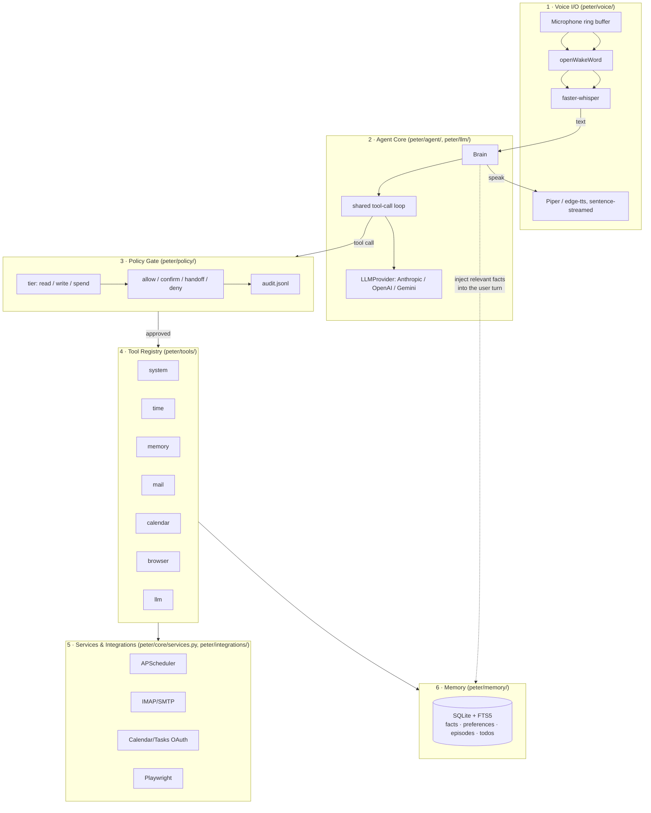

**Why this shape, not a "fleet of agents":** a single LLM loop with a large,
well-described tool registry outperforms a hand-wired multi-agent mesh for
this workload, and is far easier to debug and audit. Each layer below is
independently unit-tested; the plan explicitly reserves real subagents for
later, for genuinely parallel work (e.g. reading five product pages at once)
where a single context window would get flooded.

---

### 2.1 Voice I/O — `peter/voice/`

**Job:** turn "someone is talking near the mic" into text, and turn Peter's
reply back into audio, without ever blocking on network for the listening
part.

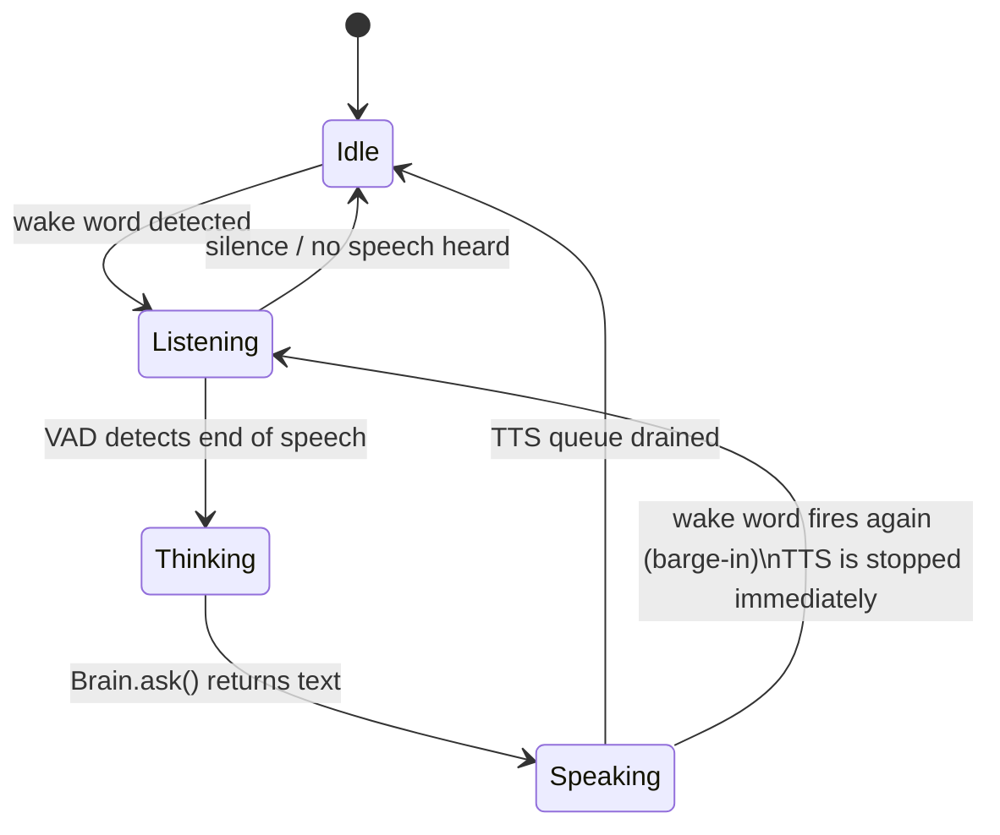

- **Wake word** (`wake.py`): `openWakeWord` running on `onnxruntime`, fully
  local. No audio leaves the machine until "Hey Peter" is detected — this is
  a hard privacy property, not a performance optimization, and is worth
  keeping even if a cloud wake-word engine were faster.
- **Speech-to-text** (`stt.py`): `faster-whisper`, endpointed by voice-activity
  detection so Peter knows when you've *stopped* talking rather than waiting
  for a fixed timeout.
- **Text-to-speech** (`tts.py`): the reply is **streamed and split into
  sentences** before being handed to the speech engine, so Peter starts
  speaking the first sentence while later ones are still being synthesized —
  this is what makes response latency feel like ~1s instead of "wait for the
  whole paragraph."
- **Barge-in**: `main.py`'s `_voice_tick()` checks the wake word *even while
  Peter is speaking*; hearing it mid-sentence calls `speaker.stop()` and
  immediately starts listening. An always-on assistant that can't be
  interrupted is unusable.
- **`--text` mode** exists specifically so every other layer can be developed
  and tested without a microphone, wake-word model, or TTS engine in the
  loop at all.

**Error handling.** Every boundary in this layer — PortAudio (mic/speaker
device), Whisper, openWakeWord, the TTS engines — can fail at runtime, not
just at startup, so each one is wrapped rather than left to raise a raw
exception into the loop:

- `Microphone.start()`, `Transcriber.__init__`/`transcribe()`, and
  `WakeWordDetector._load()` convert whatever the underlying library raises
  into `VoiceError` (`peter/core/errors.py`, an `IntegrationError` subclass),
  so callers can catch voice failures specifically instead of `except
  Exception`. Construction failures (bad model name, bad device index,
  missing wake-word file) are `recoverable=False`; a single bad transcription
  defaults to `recoverable=True` — the next utterance is worth trying.
- `run_voice()` wraps all voice-subsystem construction (mic, Whisper,
  wake word) in one try/except. On failure it logs the reason, prints it
  (there is no speaker yet at that point), and **falls back to `run_text()`**
  instead of crashing the process — the same "degrade, don't refuse to
  start" rule `build_engine()` already applied to a missing Piper voice file,
  now applied one level up.
- `build_engine()` tries the configured TTS engine first, then falls back
  through the remaining two in a fixed `piper → edge → sapi` order rather
  than stopping at one fallback — SAPI is always available on Windows, so
  this should only ever bottom out in practice, never actually fail.
- `Speaker` retries a failed sentence once immediately (a dropped frame or a
  flaky Edge request is usually transient), and after two consecutive
  failures downgrades `self.engine` to a fresh `SapiEngine` for the rest of
  the session — worse voice quality, but Peter keeps talking instead of
  going silent. It does not auto-revert; restart to retry the configured
  engine once the underlying problem (usually network, for `edge`) clears.
- `_voice_tick()` distinguishes "wake word never fired" (stays silent — no
  false-trigger nagging) from "wake word fired but nothing usable came
  through" (speaks "Didn't catch that.") — previously both were silent and
  indistinguishable to the user, which is the concrete accessibility gap
  this closes. An STT `VoiceError` gets the same "catch, speak, keep going"
  treatment `_run_turn()` already gives LLM/tool failures: logged, spoken via
  `exc.spoken()`, loop continues.

**Adaptive noise floor.** `Transcriber.calibrate()` still takes one 0.7s
snapshot at startup, but `record_utterance()`'s pre-speech lead-in frames
(already being read regardless) now blend into `noise_floor` via an
exponential moving average after every utterance (`voice.stt.adaptive_noise`,
default on; `adaptive_rate` controls how fast). A startup-only calibration
goes stale the moment the room's ambient noise changes; this keeps it current
at no extra mic time.

**Latency visibility.** The wake→reply pipeline now uses `peter/perf.py`'s
`phase()`/`reset_phases()`/`take_phases()` — the same mechanism
`PolicyGate._execute()` already applies to every tool call — bracketing
`record`, `transcribe`, and `think` (the `Brain.ask()` call), plus a fourth
phase, `tts_first_audio`, measuring the true "time to first sound": `Speaker`
tracks the moment the first audio block of a reply actually starts playing
(`_speak_one`, on its own worker thread) via a `threading.Event`, and
`_voice_tick()` waits on `Speaker.wait_for_first_audio()` before recording it.
That duration can't be measured with a synchronous `with phase(...):` block
since it completes on a different thread, so it's reported through
`perf.record_phase(name, elapsed_ms)` instead — a small addition to
`peter/perf.py` for exactly this "the end of the span is only known
asynchronously" case. One row per voice turn lands in `perf_calls` under the
tool name `"voice_turn"`, so `--perf-report` shows exactly where wake-to-reply
latency goes instead of the single bundled debug log line that existed
before — and specifically separates "how long until Peter started
responding" from "how long the reply happened to be," which total wall time
alone conflates.

**Microphone self-heal.** `Microphone.read()` — called on every voice-loop
tick regardless — now also checks whether the PortAudio input stream is
still `.active`. If it isn't (a USB mic unplugged, a driver reset) it tries
to reopen the device, rate-limited to one attempt per 2 seconds so a
genuinely-gone device doesn't spin. This mirrors
`peter/integrations/phone/adb.py`'s detect-and-reconnect pattern for a
dropped wireless ADB session — same shape, applied to the mic: a caller just
sees `read()` return `None` (indistinguishable from "nobody is talking right
now") during the outage, and frames resume on their own once the device is
back, no restart required.

**`VoiceConfirmer` (`peter/ui/confirm.py`) now actually fails closed on an STT
error**, not just on timeout/ambiguity as its own docstring already claimed.
`transcriber.listen()` inside `ask()`'s answer-listening loop can raise
`VoiceError`; unhandled, that would have crashed the confirmation (and the
whole turn) instead of escalating to `self.fallback` (a modal
`DesktopConfirmer` dialog) the way an unclear spoken answer already does. Now
it does the same thing on either failure mode — one `except VoiceError` away
from the gap this hardening pass would otherwise have quietly introduced,
since STT raising at all is new behavior from this same pass.

**SAPI's barge-in limitation is now disclosed, not just documented here.**
`SapiEngine.__init__` logs once, at construction, that barge-in on this
engine only lands between sentences rather than mid-word — true whether SAPI
is the configured engine or something else fell back/degraded to it — so the
reason interruption feels sluggish is discoverable in the log rather than
only in this file.

---

### 2.2 Agent Core — `peter/agent/brain.py` + `peter/llm/`

**Job:** decide what to say and which tools to call, on whichever LLM vendor
is currently active, without the rest of the codebase caring which vendor
that is.

#### 2.2.1 One turn, end to end

This is the sequence that runs on *every single* thing you say to Peter —
the most important diagram in this document:

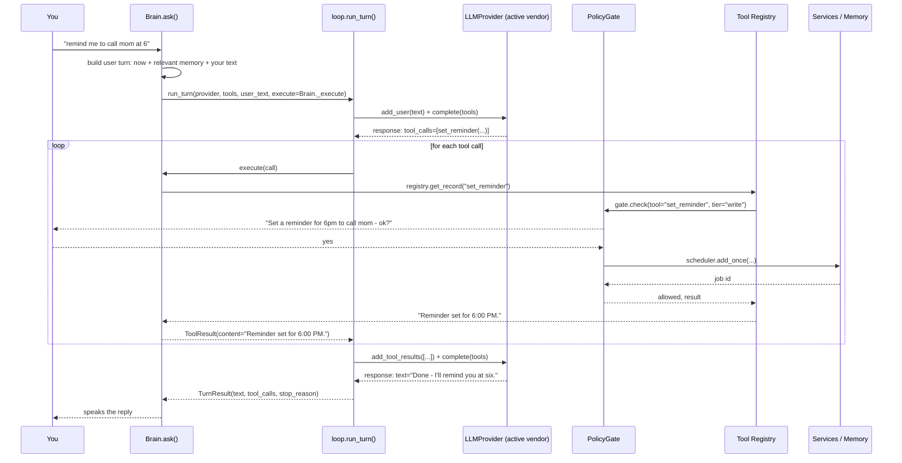

Two details that are easy to miss and matter a lot:

- **The tool loop can go around more than once.** A single user turn may
  call several tools in sequence — check the calendar, *then* decide there's
  a conflict, *then* ask for confirmation to move an event. `loop.run_turn`
  caps this at `MAX_ITERATIONS = 12` so a confused model can't spend money
  in a circle.
- **`pause_turn` is a real stop reason, not an error.** Anthropic's
  server-side tools (web search/fetch) can pause a turn mid-flight; the loop
  detects `STOP_PAUSE` and re-sends to resume, up to
  `agent.max_pause_restarts` times, instead of silently returning a
  truncated answer.

#### 2.2.2 Why there are three vendor SDKs behind one interface

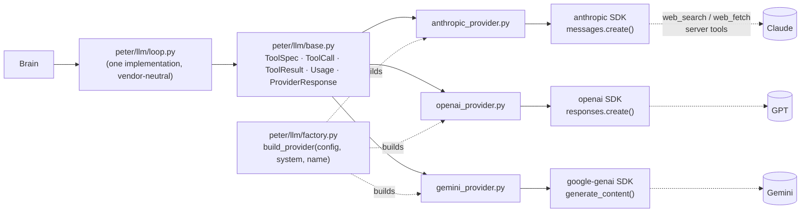

- Every vendor SDK ships its **own** auto-executing tool runner
  (`tool_runner` for Anthropic, implicit execution for OpenAI, `automatic_
  function_calling` for Gemini). All three are deliberately **not used** —
  each would run tool calls itself, bypassing the Policy Gate entirely. The
  shared `loop.py` is the only thing allowed to decide when a tool actually
  runs, and it always routes through `Brain._execute` → the registry → the
  gate.
- Each provider still has to translate the vendor's wire format into the
  shared `ToolCall` / `ToolResult` / `Usage` shapes, and each vendor has its
  own quirks the provider file absorbs so nothing above it has to know:
  OpenAI sends tool arguments as a JSON *string* that must be parsed;
  Gemini's function calls carry no call-id, so one is synthesized
  (`gemini-{index}-{name}`); OpenAI folds cached tokens *inside*
  `input_tokens` where Anthropic and Gemini report them separately, so
  `_usage()` normalizes that before it reaches the shared `Usage` type.
- **Switching provider keeps memory and cost, not conversation history.**
  The three vendors' conversation formats are structurally incompatible
  (Anthropic's content blocks vs. OpenAI's response items vs. Gemini's
  `Content`/`Part` tree), so `Brain.switch_provider()` starts a fresh
  provider-side history but carries the cumulative `Usage` total forward and
  re-injects memory on the next turn — the point of switching is usually
  "compare cost/quality," and that comparison needs the running total to
  survive.

#### 2.2.3 Prompt caching — why the system prompt is frozen

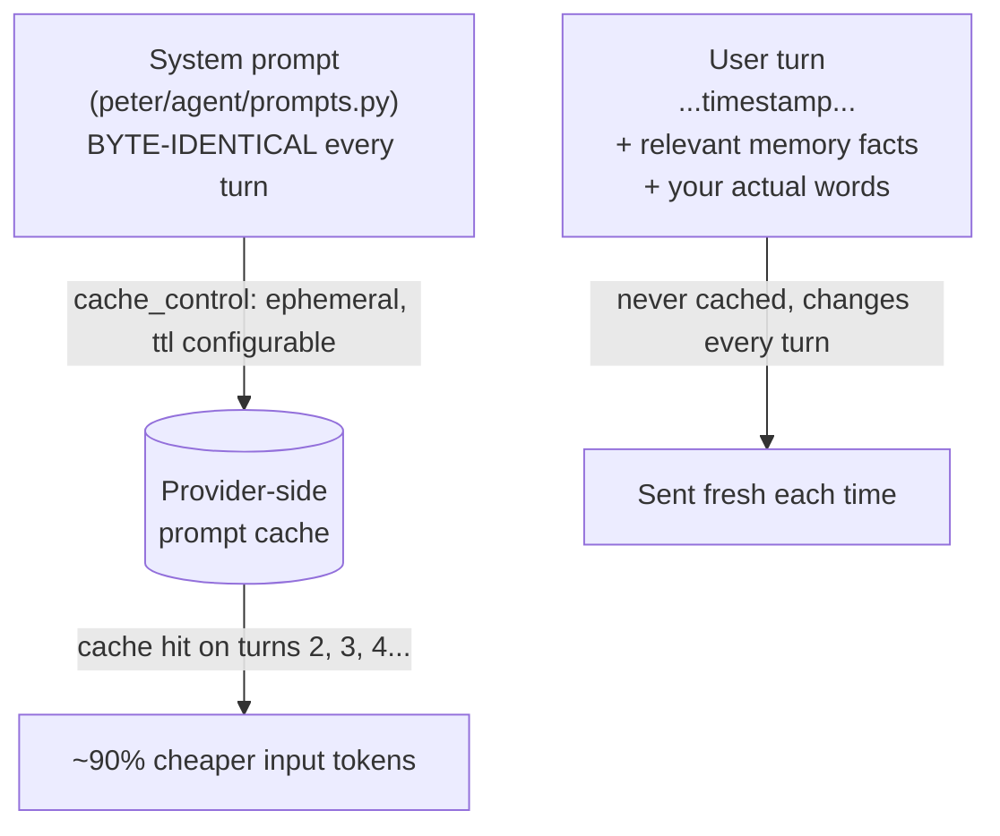

Prompt caching is a **prefix match**. The current time, today's date, or any
per-turn ID *must never* appear in the system prompt — putting it there would
silently invalidate the cache on every single turn and quietly multiply your
bill. That's why `Brain._build_user_content()` puts `<now>...</now>` and the
memory block in the *user* turn instead, keeping the system prompt frozen so
`usage.cache_read` stays non-zero from the second turn onward.

#### 2.2.4 Gemini: smart routing, same-tier fallback, and explicit caching — `peter/llm/router.py`, `peter/llm/providers/gemini_provider.py`, `peter/core/retry.py`

**Job:** when `agent.models.gemini` is set to `auto`, spend the strong model's
money only on turns that actually need it, survive Gemini being briefly
overloaded without adding real delay, and never let either of those things
quietly break prompt caching.

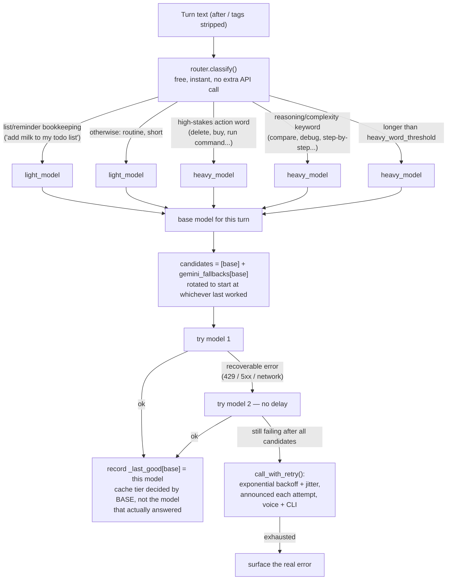

- **The router is a free heuristic, not an LLM call.** `classify()` runs a
  handful of regexes against the turn's own text — checked in a specific
  order, because order is where this went wrong twice in testing: bare
  words like "why" or "explain" matched so much ordinary conversation that
  *most* turns escalated to the expensive model, which is the opposite of
  the goal; then "add buy milk to my todo list" escalated because "buy"
  appeared inside the todo item's own text. The fix was checking list/
  reminder bookkeeping **first** (an unconditional escape to the cheap
  tier) and requiring genuine complexity phrases rather than single common
  words for everything after it.
- **Same-tier fallback is a fast hedge, not the backoff.** `gemini_fallbacks`
  in config.yml maps a model to same-*price* substitutes
  (`gemini-3.7-flash → gemini-3.6-flash → gemini-3.5-flash`), tried
  immediately with zero delay between them — this is what covers "one
  specific model is briefly overloaded." The exponential backoff below it
  only engages once every candidate in that list has also failed, which
  means the whole deployment (not just one model) is actually down.
- **Fallback is sticky.** `_last_good[base]` remembers which candidate
  worked last, so once a session has fallen over to `gemini-3.6-flash` it
  starts there next turn instead of re-probing the dead primary every
  single time — cheap to check, and it's what keeps "no added delay" true
  across a whole session, not just the first retry.
- **Caching has to key off the *routed tier*, not the model that actually
  answered — this was a real bug, found by testing the fallback live.**
  `_should_cache()` originally compared `self.model` to `auto_light_model`
  literally; once a session fell back to `gemini-3.6-flash`, that
  comparison went permanently false and silently disabled caching — and
  its ~90% saving — for the rest of the session, even though 3.6-flash is
  the same price tier and equally cacheable. Fixed by tracking
  `self._current_base` (the tier the router picked, set once per turn
  before any fallback rotation) and comparing *that* instead.
- **The heavy tier is never cached.** Caching only applies to the light
  model — the heavy model is used rarely enough per session that paying to
  *create* a cache for it would cost more than it saves.
- **Retry announces itself, in both voice and text.** `call_with_retry()`
  (used for the outer backoff, and by anything else in the codebase that
  needs the same shape) takes an `on_retry` callback; `Brain._on_retry`
  speaks "Gemini isn't responding (attempt 2 of 5). Retrying in 20
  seconds..." through `services().say()` — so a real outage is narrated,
  not silent, in whichever mode you're in.
- **Cost displays in ₹, not $.** Every vendor bills in USD; `Usage.summary()`
  converts using `agent.usd_to_inr_rate` (a manually maintained rate, no
  live FX feed) only at display time — the underlying `cost_usd` totals stay
  in USD, since that's what every pricing table in `pricing.py` is
  denominated in.

---

### 2.3 Tool Registry — `peter/agent/registry.py` + `peter/tools/`

**Job:** turn a plain Python function into something an LLM can discover,
understand, and call — for all three vendors, from one definition.

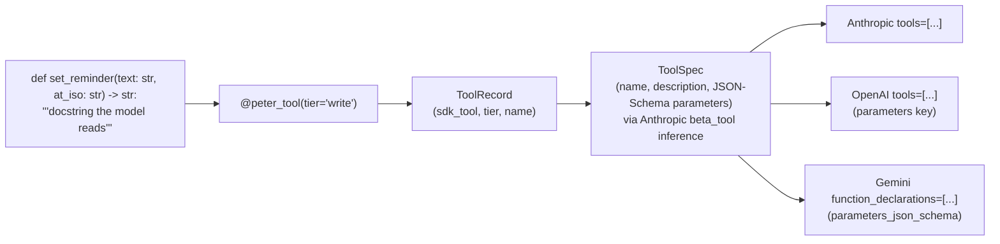

- **One decorator, three vendors.** `@peter_tool(tier=...)` wraps the
  function once; the Anthropic SDK's schema-inference (from type hints +
  docstring) is reused as the JSON-Schema engine for *all three* providers —
  not because Anthropic is privileged, but because it's already correct and
  rewriting signature→schema inference three times would just be three
  chances to get it wrong differently.
- **Tool order is part of the cached prefix.** `tool_specs()` returns tools
  in a stable, sorted order deliberately — a registry that reordered itself
  between runs would invalidate the prompt cache for no reason.
- **146 tools currently registered**, split by permission tier:

| Module | Read | Write | What it covers |
|---|---:|---:|---|
| `system.py` | 6 | 9 | apps, files, clipboard, volume, screenshot, stats, lock, PowerShell |
| `mail_tools.py` | 6 | 5 | read/search/send/star/archive/delete + inbox_digest + waiting_on |
| `time_tools.py` | 3 | 6 | alarms, timers, reminders, to-dos |
| `calendar_tools.py` | 4 | 4 | events + Google Tasks |
| `browser_tools.py` | 6 | 4 | read/click/type/login, plus multi-site comparison |
| `desktop_tools.py` | 2 | 6 | apps, bookmarks, YouTube, media keys, local folders |
| `memory_tools.py` | 2 | 4 | facts + preferences |
| `focus_tools.py` | 1 | 2 | timed mute-and-restore focus sessions |
| `briefing_tools.py` | 2 | 0 | morning briefing status |
| `llm_tools.py` | 2 | 1 | switch / inspect provider, spend report |
| `vision_tools.py` | 3 | 0 | look at the screen, an image, or the browser page |
| `watch_tools.py` | 2 | 2 | standing price and stock watches |
| `workspace_tools.py` | 1 | 3 | save / restore a set of open applications |
| `docs_tools.py` | 3 | 2 | index folders, search them, answer from them |
| `recorder_tools.py` | 4 | 3 | record, transcribe, summarise, read back |
| `dev_tools.py` | 7 | 0 | git, PRs, CI, work log, standup |
| `telegram_tools.py` | 1 | 1 | send to your phone, bridge status |
| `phone_tools.py` | 5 | 12 | SMS, one-time code, call log, phone screen, phone status / open a link, save a screenshot, transcribe a voice note, call a contact/make/answer/end a call, Spotify play/pause/skip, set/dismiss a phone alarm |
| `expense_tools.py` | 1 | 1 | scan bank/UPI SMS, report spending |
| `delivery_tools.py` | 1 | 1 | scan courier SMS, list pending shipments |
| `weather_tools.py` | 1 | 0 | current weather (Open-Meteo, no key needed) |
| `routine_tools.py` | 1 | 1 | run / list config-defined tool chains |
| `news_tools.py` | 1 | 0 | top headlines (Google News RSS, no key needed) |
| `notes_tools.py` | 2 | 2 | add/search/list/delete quick journal notes |
| `perf_tools.py` | 1 | 0 | per-tool timing report (busiest tools, native-rewrite candidates) |
| `skill_tools.py` | 1 | 0 | list every skill and its usable/not-configured status |
| **Total** | **69** | **69** | |

  Seven of the write-tier tools are pulled back to *confirm* by standing rules
  in `config.yml` — `delete_file`, `delete_email`, `delete_calendar_event`,
  `run_powershell`, `lock_workstation`, `send_email`, `make_phone_call`. Those
  destroy data, run arbitrary commands, send something that cannot be unsent,
  or — the newest addition — connect a real phone call with no on-device
  confirmation screen of its own to catch a misheard number. `call_contact`
  is a deliberately separate tool from `make_phone_call` rather than an
  optional argument on it, specifically so it can sit *outside* that standing
  rule: it only ever dials a number already saved under a real name in the
  phone's own contacts, a materially different risk from a number the model
  transcribed from speech — and the gate applies a tier per tool, not per
  argument, so two different confirmation behaviours could not have shared
  one tool. Everything else new in §2.15 (answering, hanging up, media
  control, alarms) stays plain `write`: either time-sensitive enough that a
  confirm prompt would defeat the point (an unanswered call goes to voicemail
  while you're confirming), or trivially reversible.

  **Tool groups whose credentials are missing are not registered at all**
  (`_REQUIRES` in the registry). Every schema is re-sent on every API call, so
  an unusable group costs ~1,000 tokens per request to describe actions that
  can only fail. `prompts.py` still states plainly which integrations are
  unconfigured, so Peter can say "you have not set that up" without carrying
  the schemas to do it.

  Notice there is no `spend` tier in this table — see §2.6, that boundary is
  enforced structurally in the browser layer, not by a tool flag that a
  mistake could flip.

---

### 2.4 Policy Gate — `peter/policy/gate.py`

**Job:** the one place every tool call passes through before its body runs.
Nothing calls a tool directly.

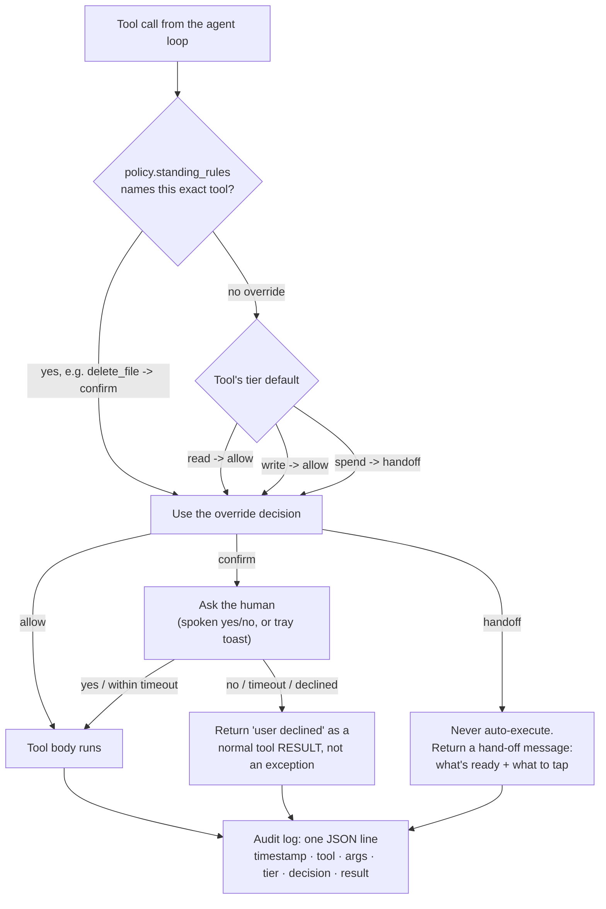

- **`write` defaults to `allow`, not `confirm`.** Early on, every write-tier
  tool prompted — opening an app, playing a video, adding a calendar event,
  all needed a spoken yes/no. In practice this trained the habit of
  reflexively saying "yes" to everything, which defeats the point of
  asking. The tier default flipped to `allow`; only tools in
  `policy.standing_rules` that are genuinely destructive or hard to
  reverse — `delete_file`, `delete_email`, `delete_calendar_event`,
  `run_powershell`, `lock_workstation`, `send_email` — are pulled back to
  `confirm`. `spend` still always hands off and never even reaches a
  prompt.
- **Per-tool overrides beat the tier default in *either* direction** —
  `standing_rules` can loosen a tool (`set_reminder: allow` even though
  reminders aren't literally read-tier) or tighten one (the destructive list
  above), all from `config.yml` with no code change.
- **A decline is a tool *result*, not a raised exception.** If it raised,
  the whole turn would abort and the user would hear nothing but a
  generic error. Returning it as text means the model sees "the user
  declined" and can react naturally — apologize, offer an alternative, ask
  what to do instead.
- **Fails closed.** The default confirmer when nothing else is wired up
  (`AlwaysDeny`) refuses everything rather than allowing it. A Peter that's
  annoyingly cautious is a nuisance; one that silently allows destructive
  actions because no confirmer was configured is a disaster.
- **Every decision is audited**, approved or not — `data/audit.jsonl` is the
  forensic trail for "why did Peter do that."

---

### 2.5 Memory — `peter/memory/store.py`

**Job:** remember things across restarts, and surface the *relevant* ones
without being asked.

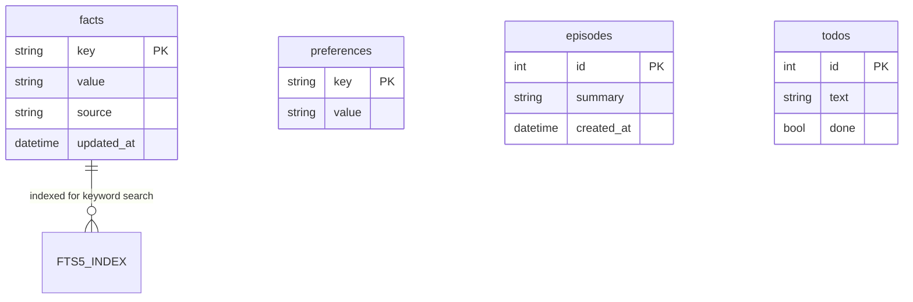

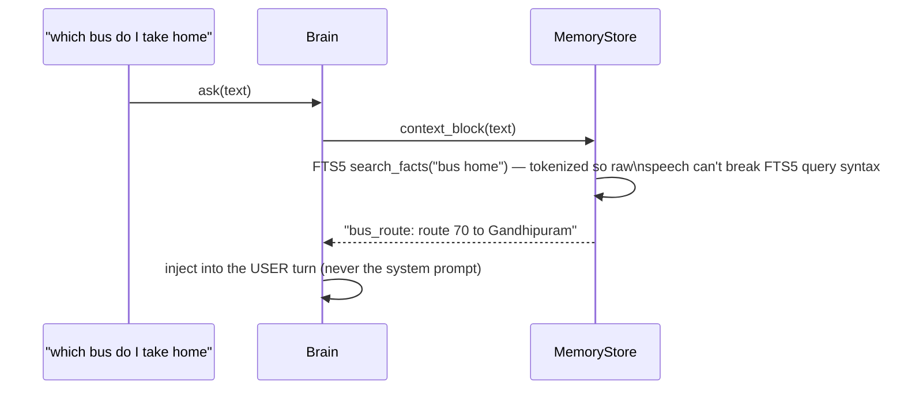

- **SQLite + FTS5**, four tables: `facts` (durable statements about you),
  `preferences` (how Peter should *behave* — e.g. "keep replies under two
  sentences"), `episodes` (rolling conversation summaries), `todos`.
- **Recall is automatic, not a tool the model has to remember to call.**
  Every turn, `Brain._build_user_content()` runs a keyword search over your
  message and silently prepends whatever facts share a token with it — the
  bus-route example above only works because "bus" appears in both the
  stored key's value and your question.
- Speech is tokenized before it reaches FTS5's query parser specifically
  because raw transcribed speech can contain characters (quotes, hyphens,
  stray punctuation) that are meaningful *syntax* to FTS5's query language —
  an untokenized query can outright fail to parse.

#### Hybrid retrieval — `peter/memory/embeddings.py`

Keyword search only finds a fact when you reuse the words you stored it with.
Measured on 130 stored facts with paraphrased questions, FTS5 alone recalled
**3/10** — and filled the empty slots with unrelated facts, spending tokens on
noise. Adding a local embedding index takes that to **10/10** while injecting
*fewer* facts per turn, at ~5ms per query.

| | recall@5 | facts injected/turn |
|---|---|---|
| keyword only (FTS5/BM25) | 3/10 | 8 (flat) |
| hybrid, threshold 0.35 | 6/10 | 0.8 |
| **hybrid, threshold 0.15** | **10/10** | **3.9** |

Both halves are kept and unioned, because each covers the other's blind spot:
embeddings find "how do I get to work" → "route 70 bus", which keywords
cannot; keywords find an exact registration number or account id, which a
sentence model has no useful vector for. The threshold's real job is returning
**nothing** when nothing is relevant — an unrelated question retrieves zero
facts rather than the least-bad match.

**Why this is where retrieval belongs.** The memory block is ~572 tokens
against ~15,469 for the tool schemas — but it goes in the *user* message,
so it is billed at full price every turn while the tool schemas are served
from the prompt cache at roughly a tenth. Per token it is about **10x more
expensive**, which is why filtering here pays and why `agent.tool_filter`
(which filters *cached* tokens, trading a 10x discount for a shorter list)
is correctly off by default. End to end the block shrinks ~35%.

**No new dependency.** `onnxruntime` was already present for openWakeWord,
`tokenizers` arrived with faster-whisper, `numpy` runs the voice pipeline —
together a complete embedding stack, so this costs one ~23MB model file and
nothing else. Vectors are brute-forced with numpy rather than stored in a
vector database: at a personal assistant's scale a dot product against the
whole set is microseconds, and an index would be a dependency and a failure
mode bought for no measurable speedup. Embeddings are computed locally, so
**memory never leaves the machine** — the same property the wake word has,
and the reason not to call a hosted embedding API.

**Optional at every point.** No model file means `available()` is False and
every path falls back to the FTS5 search that was always there; the whole
suite passes with no model present. Vectors live in side tables
(`fact_vectors`, `preference_vectors`, `preference_scope`) rather than as new
columns, because the schema is applied with `CREATE TABLE IF NOT EXISTS`,
which would silently not add a column to an existing `peter.db`.

**Preference scope.** Preferences could not simply be retrieved: "keep replies
short" applies to every turn, while "prefer Amazon for price checks" only
matters sometimes. So each carries a scope — `always` (injected unconditionally,
and the default) or `contextual` (retrieved). Defaulting to `always` is the
safe direction: one wrongly marked contextual silently stops applying, while
one wrongly marked always merely costs a few tokens. A preference stored
before scopes existed has no row and is therefore treated as `always`, so
old databases keep their exact previous behaviour.

---

### 2.5b Learning from a correction — `peter/agent/learning.py`

**Job:** notice when you have just corrected Peter, and turn that into a rule
that survives the conversation — so the same correction is not needed again
next week.

The storage half of this already existed: `set_preference`/`remember_fact`
write it, `context_block()` replays it. What was missing was the *trigger* —
none of that happened unless the model itself chose to call a memory tool
mid-conversation, which it rarely did.

```mermaid
flowchart TD
    A["turn N: 'no, always keep it short'"] --> B{"looks_like_correction()<br/>keyword pre-filter, no model call"}
    B -- no --> Z["ordinary turn — costs nothing"]
    B -- yes --> C["one isolated, tool-free model call<br/>sees turn N-1's ask, reply, and this correction"]
    C --> D{"does it generalise<br/>past this one request?"}
    D -- no --> E["NOTHING — the common, expected answer"]
    D -- yes --> F["preference&#124;key&#124;value<br/>or fact&#124;key&#124;value"]
    F --> G["stored, announced in the reply"]
    G --> H["replayed by context_block() on every later turn"]
```

Three restraints matter more than the happy path, because a system that
learns the *wrong* thing permanently is worse than one that never learns:

- **It prefers silence.** The extractor is instructed to answer `NOTHING`
  unless the lesson holds beyond this one request, and `NOTHING` is the
  documented default rather than a failure. "No, make it 6pm instead" is a
  changed mind, not a rule that every reminder is at 6pm. `_parse()` treats
  anything off-format as `NOTHING` too — it is reading untrusted model output
  on its way into long-term memory, so the bar is the exact documented shape.
- **It never deletes to make room.** Preferences are injected on *every* turn
  and so cannot grow unbounded, but `max_preferences` is a **refusal** limit,
  not an eviction limit: at the cap Peter declines to learn something new and
  says so, rather than dropping a preference you set on purpose. Updating an
  existing key is still allowed, since that does not grow the list.
- **It says what it learned.** The stored lesson is appended to the spoken
  reply, and `list_preferences` / `forget_preference` already exist to audit
  and undo it. Behaviour that changes without telling you is indistinguishable
  from a bug.

**Cost.** The keyword pre-filter settles an ordinary turn with a regex, so no
model call happens at all on a normal turn. A false positive there costs one
cheap call that returns `NOTHING` — deliberately the cheap failure, versus a
false *negative*, which silently loses the lesson. The call runs after the
answer is already in hand, so nothing the user is waiting on is delayed except
the note itself. And because memory is injected into the **user** message
rather than the system prompt (see §2.5), a newly learned preference does not
invalidate the cached prompt prefix.

---

### 2.6 Browser Automation — `peter/integrations/browser/`

**Job:** the only way to interact with the sites that have no API at all
(Blinkit, Zepto, Myntra, Meesho, Swiggy, Zomato, most of Flipkart) — while
never being able to spend money and never getting the whole session banned.

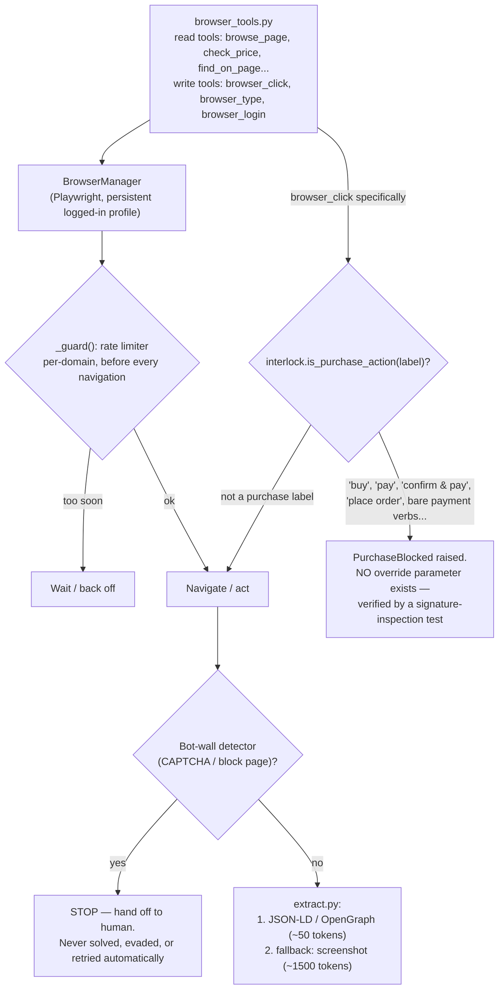

- **Structured data first, screenshots last.** Almost every commerce page
  already publishes JSON-LD/OpenGraph product data for Google Shopping to
  read — price, name, availability, brand. Reading *that* costs roughly 50
  tokens; a screenshot costs roughly 1,500. Screenshots are the fallback
  when structured data is genuinely absent, not the default.
- **Per-domain rate limiting is the primary anti-ban strategy** — more
  effective in practice than trying to out-fingerprint commercial bot
  detection (Akamai/PerimeterX/Cloudflare all run on these sites). A
  persistent, real, headed browser profile with genuine cookies plus slow,
  human-paced polling avoids most of what would otherwise get an account
  suspended.
- **A bot-wall (CAPTCHA, block page) is a stop signal, never a puzzle.**
  `detect.py` exists to *recognize* that state and hand off to you, not to
  solve it.
- **The purchase interlock has no bypass parameter, on purpose.** This
  isn't "ask before buying" — the function that would complete a purchase
  simply doesn't exist in a callable form. `guard()` takes only a label to
  check, and a dedicated test inspects the function's *signature* to assert
  no override argument was ever added back in by accident.  This is the
  code-level enforcement of RBI's mandatory-2FA rule from §1.3: even if the
  policy gate were somehow bypassed, this layer still can't complete a
  payment.
- Ten tools total (one of them, `compare_across_sites`, delegates to the
  §2.16 subagent fan-out rather than reading a page itself), split precisely
  because a single `browse_and_extract` tool can't carry one permission tier:
  reading is `read`, clicking/typing is `write`, and "place order" isn't a
  *tier* at all — it's structurally unreachable.
- **The engine itself is configurable** (`integrations.browser.engine:
  chromium | firefox`, default `chromium`) — Playwright drives Firefox just
  as directly as Chromium, as its own bundled build rather than your
  installed one, so "log me in to Myntra" can open in whichever browser
  feels native rather than always defaulting to something Chrome-shaped
  regardless of `desktop.preferred_browser` (§2.6b — a genuinely different
  setting, since that one only ever opens plain links for you to look at).
  Chromium's anti-detection launch flag
  (`--disable-blink-features=AutomationControlled`) is Chromium-only CLI
  syntax; sending it to Firefox fails the launch outright rather than being
  ignored, so `_ENGINE_ARGS` is keyed per engine instead of hardcoded.
  Switching engine needs a fresh `profile_dir` — a Chromium user-data
  directory and a Firefox profile are structurally incompatible formats, so
  a launch against the wrong one fails rather than silently doing something
  odd.

---

### 2.6b Desktop control — `peter/integrations/desktop/`

**Job:** drive the software already installed on the machine — your own
browser, its bookmarks, whatever is playing, and local folders — from a spoken
request that never names anything exactly.

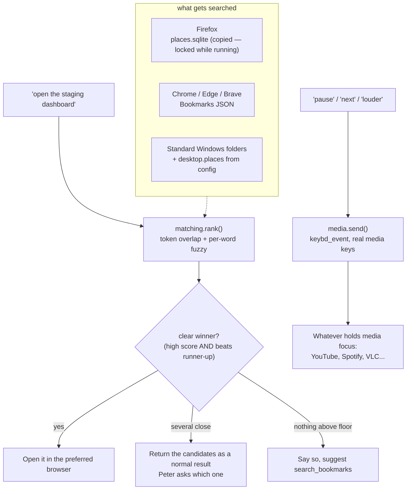

Four decisions worth knowing:

- **Ambiguity is a result, not a failure.** With 104 real bookmarks, "log
  search" genuinely matches four things. `rank()` only reports a confident
  winner when the top score is high *and* clears the runner-up by a margin;
  otherwise the tool returns the candidates and Peter asks. Silently opening
  one of four similar bookmarks is worse than one short question.
- **Character similarity cannot carry a match on its own.** Found live:
  `"zzz nothing"` scores 0.44 against `"HDFC Net Banking"` on incidental
  shared letters. Fuzzy scoring is discounted by half unless at least one word
  actually overlaps — but per-*word* similarity is kept, so `"dashbord"` still
  finds `"dashboard"`, which is what a speech transcript really produces.
- **Firefox's bookmark database is copied before reading.** `places.sqlite` is
  locked exactly when you want it — while Firefox is open — so it is copied to
  temp and the copy is queried.
- **Playback uses real media keys, not page automation.** `keybd_event` with
  the same virtual keys as a media keyboard, so Windows routes them to whatever
  currently has media focus. Driving the YouTube page through Playwright would
  only work for YouTube, only in Peter's own browser instance, and would break
  whenever the markup changed.
- **YouTube can open in a different browser than everything else.**
  `desktop.youtube_browser` (e.g. Brave) overrides `preferred_browser`
  (e.g. Firefox) specifically for `youtube.com`/`youtu.be` URLs — checked
  once, in `_open_with_preferred()`, so it applies uniformly whether the
  video came from `play_youtube`, `open_named_site("youtube")`, or a
  YouTube bookmark. Left blank, there is no override and everything shares
  one browser as before.

YouTube search deserves its own note: the top result is found by fetching the
search page and reading the `"videoId"` fields out of the JSON embedded in its
HTML — no API key, no quota, no browser. It depends on an internal page format,
so it fails cleanly: if the pattern stops matching, the tool opens the search
results page instead of doing nothing.

### 2.7 Integrations — `peter/integrations/{mail,google}/` + `peter/core/services.py`

**Job:** everything networked and optional is built **lazily**, on first
use, and never blocks startup.

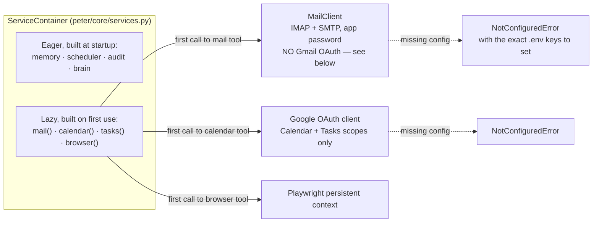

- **Why IMAP/SMTP instead of the Gmail API for mail:** a personal Google
  Cloud project in "Testing" status issues refresh tokens for Gmail's
  *restricted* scope that **expire after 7 days** — Peter would silently
  stop reading your email every week until manually re-authorized. Moving
  to "In Production" for a restricted scope requires a third-party Google
  security audit, unrealistic for a personal project. Plain IMAP with an
  app password sidesteps the OAuth trap entirely for reading mail, at the
  cost of losing Gmail's label/thread richness.
- **Calendar/Tasks stay on OAuth** because those scopes are only
  *sensitive*, not *restricted* — they don't carry the 7-day trap, so a
  narrow, separate OAuth client for just those two scopes is fine.
- **Constructing a client is deferred until the first tool call that needs
  it.** Building an IMAP connection at process startup would mean Peter
  refuses to boot when the wifi is briefly down, and adds seconds to launch
  for integrations a given session might never touch. `NotConfiguredError`
  carries the *exact* fix (which `.env` keys, which CLI flag) rather than a
  bare failure.
- `ServiceContainer.health()` (surfaced by `python -m peter.main --health`)
  walks every provider/integration and reports its real state — this is the
  single command that answers "is everything wired up correctly."

#### Contacts and Drive — same OAuth client, two more scopes

`peter/integrations/google/contacts.py` (People API, read-only) and Drive
support inside `peter/docs_index.py` reuse the exact OAuth client Calendar/
Tasks already build (`peter/integrations/google/auth.py`) — no new auth
module, just two more scopes on `GoogleConfig.scopes`
(`contacts.readonly`, `drive.readonly`).

**A scope added after a token already exists doesn't retroactively cover
it.** A user who authorised before these scopes existed keeps working for
Calendar/Tasks but gets a 403 on the first Contacts/Drive call — already
handled by the exact `_call()` pattern `calendar.py`/`tasks.py` established
(403/401 → `AuthError` naming `--google-auth`), so this needed a docs
callout, not new code.

**Contacts is deliberately not wired into `send_email`.** `find_google_contact`
resolves a name to a real address; `send_email` still requires the address
itself. Same split `call_contact`/`make_phone_call` already established in
`peter/tools/phone_tools.py` — resolving a name is a different trust
boundary than a write action trusting whatever string it's handed, and
that boundary is worth keeping consistent across every place a name gets
resolved to a contact detail, not just the phone.

**Drive is a second source in the existing document index, not a second
store.** `peter/docs_index.py`'s `documents.path` is already just a text
primary key and `documents.folder` a free-text label — a Drive file fits as
`path = "gdrive://<file_id>"`, `folder = "Google Drive"`, no schema change.
`search_docs`/`ask_docs`/`docs_index_status` needed **zero** changes; they
already query every row in `documents` regardless of source.
`index_drive_folder()` lists one folder non-recursively (an explicit
target, not an open-ended Drive crawl), exports Google Docs/Sheets/Slides
to text (they have no native binary content), downloads everything else
already in the `extensions` allowlist, and reuses `_chunk()`/the insert
path verbatim — its only job is getting Drive bytes into the same shape
`_index_one()` already consumes for local files.

#### Google Keep — the one integration that isn't OAuth

`peter/integrations/google/keep.py` exists because there is **no official
Keep API for a personal Google account** — the real one is Workspace-only,
gated behind an admin granting domain-wide delegation, which a plain
`@gmail.com` address has no path to. The only way in is `gkeepapi`, an
unofficial client authenticating with a **master token**: the same
capability level as your account password, obtained once outside Peter
(gkeepapi's own documented method), not a scoped, individually revocable
OAuth grant.

This module deliberately does **not** import `peter.integrations.google.auth`
— sharing it would misleadingly imply Keep uses the same, safer flow every
other Google integration here does. It does not, and every setup doc says
so before showing how to enable it.

`KeepConfig.enabled` defaults to **`false`**, the only `enabled: true`-by-
default exception in `IntegrationsConfig` — nothing should attempt an
account-wide, unofficial login unless a human has explicitly opted in and
provided the token. `gkeepapi`'s own exception hierarchy
(`LoginException`, `APIException`, `SyncException`) gets the same
translate-into-`AuthError`/`IntegrationError`-with-a-`user_action`
treatment `_call()` gives `HttpError` elsewhere, just against a different
library — including one subtlety worth naming: `_sync()`'s generic
exception handler must not re-wrap an `AuthError` that `_authenticate()`
already raised (accessing the lazy `self.keep` property can trigger it),
which is exactly the kind of double-wrapping bug a test caught during
development — see `tests/test_keep.py`.

---

### 2.8 Scheduler — `peter/scheduler/jobs.py`

**Job:** alarms, timers, reminders, and the daily briefing must survive the
process being killed and restarted — a reminder that silently disappears on
a crash is worse than no reminder at all.

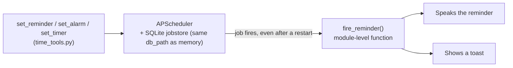

- **Job targets must be module-level functions**, never bound methods or
  lambdas — APScheduler serializes a job by its Python *import path* to
  survive a restart, and a bound method or lambda has no stable import path
  to serialize. This is why `fire_reminder()` is a free function, not a
  method on `Scheduler`.
- Alarms, timers, and reminders are three thin wrappers (`add_once`,
  `add_in`, `add_daily`) over the same underlying job store, so "survives
  restart" is one property proven once, not three times.

---

### 2.9 Supervisor loop — `peter/main.py`

**Job:** own every long-lived object, wire the layers together, and make
sure one bad turn never takes down the whole session.

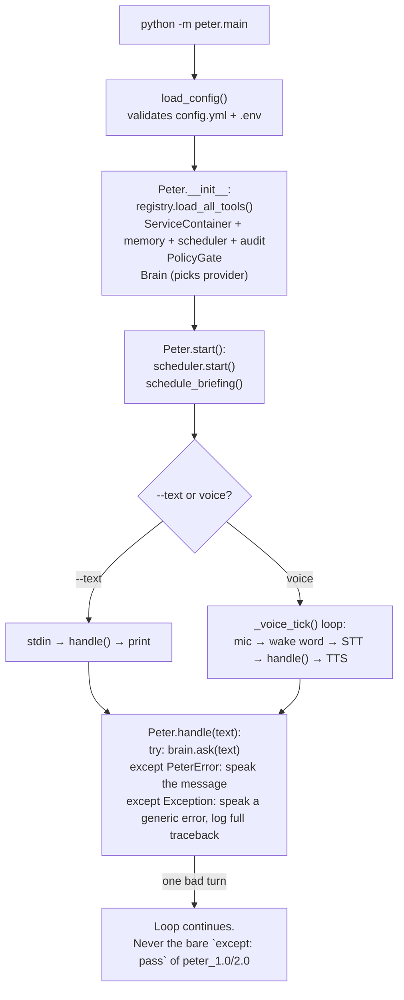

- **Every turn is isolated.** `handle()` catches both known (`PeterError`)
  and unknown exceptions, turns either into something speakable, and lets
  the *loop* continue — this directly replaces peter_1.0/2.0's single
  `except: pass` around the entire program, which either died silently or
  killed the whole assistant with no trace of why.
- **Nothing is a module-level global.** Every service is constructed in
  `Peter.__init__`, held in one `ServiceContainer`, and torn down in
  `shutdown()` — this is what makes the whole thing testable: tests build
  their own container and swap it in instead of fighting shared global
  state.
- `--health`, `--devices`, `--briefing`, `--google-auth` are all short-lived
  commands that build just enough of the container to answer the question
  and exit — they do not start the voice loop.

---

### 2.9b CLI status line — `peter/ui/progress.py`

**Job:** in `--text` mode, show *exactly* what a turn is doing at every
moment — not just "Peter is thinking" for the whole turn regardless of
whether it's calling zero tools or five — without any of that ever
corrupting the confirm prompt or a log line sharing the same terminal.

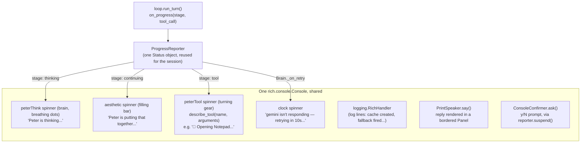

- **`describe_tool()` reads the tool call's actual arguments, not just its
  name.** A curated map of ~70 tools each carry an emoji + template
  (`open_app` → `"🚀 Opening {name}"`), filled in from the call's own
  arguments — so the status line says *what* is being opened/sent/deleted,
  not just that something is happening. Any tool not in the map still gets
  a readable fallback (humanized snake_case), so a newly added tool never
  breaks this.
- **The branded spinners are registered into Rich's own spinner table**
  (`rich.spinner.SPINNERS["peterThink"] = {...}`), not vendored — a plain
  dict mutation at import time, keyed by frames of equal length so the
  status line doesn't jitter sideways as it animates (a real failure mode
  of naive emoji-cycling spinners).
- **One Console, shared by the spinner, the logger, and replies — this was
  a real, found-live bug, not a hypothetical.** `RichHandler` originally
  opened its *own* `Console`; two independent writers issuing ANSI redraw
  codes to the same terminal is exactly what produced garbled output like
  `⢃⠨ 🧠 Peter is thinking...[18:09:25] INFO prompt cache created...` on one
  line. `main()` now builds a single `Console` and threads it through
  `configure_logging(console=...)` and `Peter(console=...)`, which is what
  lets Rich suspend-and-redraw correctly around a log line instead of the
  two colliding.
- **Replies render in a bordered `Panel`, not a bare `print()`.** Fixes the
  same class of problem from a different angle: a multi-fact answer ("CPU
  is X, memory is Y, disk is Z...") used to print as one line mixed into
  the log stream; a Panel visually separates it. Along the way this caught
  a second, unrelated Rich landmine: `"[peter]"` looks exactly like markup
  (a style tag named "peter"), so printing it unescaped silently vanished
  instead of showing — worth knowing if any other literal-bracket text ever
  needs to go through this console.
- **The confirm prompt suspends the spinner for exactly its own duration**,
  via an injectable `suspend()` context manager on `ConsoleConfirmer`
  (`reporter.suspend`) — a spinner still animating while `input()` reads
  stdin mangles both the `[y/N]` text and whatever gets typed in response.
  Suspending only around the prompt, not the whole turn, means a turn with
  several confirmations in a row still shows the spinner between them.

---

### 2.10 Proactive features — `peter/meeting_prep.py`, `peter/inbox_digest.py`, `peter/focus.py`

**Job:** speak up without being asked, without ever taking an action that
matters on your behalf and without becoming a nag once it has already said
something.

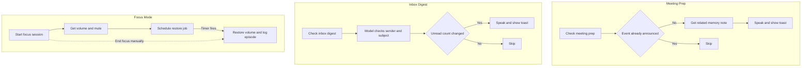

- **Meeting prep and the inbox digest both poll rather than pre-schedule.**
  A calendar event can be moved or cancelled, and new mail arrives
  continuously — a job scheduled once, in advance, would be checking a fact
  that may no longer be true by the time it fires. Polling re-reads the
  live state every time instead.
- **Dedup is what keeps "proactive" from becoming "annoying."** Meeting prep
  remembers which event ids it has already announced (pruned after 24h); the
  inbox digest remembers the last unread count it spoke and stays quiet
  until that number actually changes. Both dedup stores are in-process only
  — lost on a restart, which just risks one repeated nudge, never a missed
  one.
- **The inbox digest's classification is a real model call, deliberately
  small.** A keyword heuristic cannot tell an HR reminder from a production
  incident; a full conversational turn would cost far more than the task
  needs. `factory.build_provider()` builds a fresh, tool-free provider
  against a plain numbered sender/subject list (never message bodies) using
  whichever vendor is already configured — the same function that builds
  the main conversation's provider, just pointed at a one-shot prompt
  instead. On any failure it degrades to reporting the bare unread count,
  never to drafting or sending anything; it is read-only by construction,
  not by convention.
- **Focus mode's restore survives a restart because the value to restore is
  baked into the scheduled job's own arguments**, in the same persistent
  SQLite jobstore reminders use (§2.8). The in-process `_active` state that
  backs `focus_status()` and an early `end_focus_session()` does *not*
  survive a restart — only the actual system-level restore does, which is
  the half that actually matters.

---

### 2.11 Reaching you off the desk — `peter/telegram_bridge.py`, `peter/integrations/telegram/`

Everything in §2.10 announces itself with a spoken line and a desktop toast.
Both only exist if you are sitting in front of the machine, which makes every
proactive feature worth roughly nothing the moment you walk away. The Telegram
bridge is the multiplier that fixes that, in both directions.

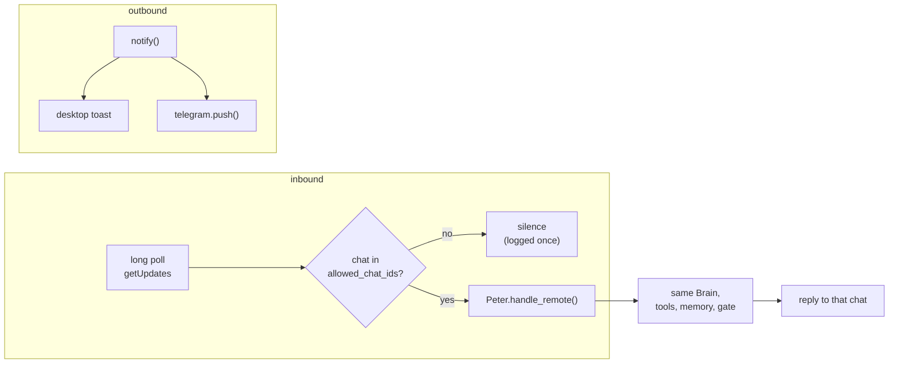

Four decisions, all of them security rather than design taste:

- **An unknown chat gets no reply at all.** A bot token is effectively a public
  endpoint — anyone who finds the bot's name can message it. Replying "you are
  not authorised" confirms the bot is alive and worth attacking. Silence does
  not. An empty `allowed_chat_ids` therefore means *nobody*, not *everybody*.
- **The backlog is dropped at startup.** Telegram holds undelivered updates for
  24 hours. Without this, everything sent while Peter was off would execute in
  a burst on restart — including instructions already carried out by hand.
- **Confirmations are declined, not deferred.** A `confirm`-tier tool reads the
  local console or the microphone, neither of which a phone can reach. A remote
  turn installs a `RemoteConfirmer` that declines immediately with its own
  explanation, rather than blocking for the full confirmation timeout and then
  declining anyway. Destructive actions stay at the desk.
- **Turns are serialised.** The bridge runs in its own thread while the mic or
  console may also be producing turns, and the provider owns one conversation
  history. `Peter._turn_lock` is what stops two turns interleaving into it —
  and is also what makes swapping the confirmer per-turn safe.

`notify()` gained a second channel rather than the features gaining a Telegram
dependency: reminders, meeting prep, the inbox digest, focus completion, price
alerts and CI failures all reach the phone without any of them knowing Telegram
exists. Both channels are independently best-effort; a failed push never fails
the job behind it.

The Bot API is reached with `urllib` — no new dependency. `getUpdates` is a
*long* poll, so a 25-second timeout is one held HTTP request that returns the
moment a message arrives, which is both cheaper and more responsive than
polling every second.

**A submodule silently shadowed the client accessor — a real bug, found by
running `--telegram-setup` twice in a row, not by reading the code.**
`peter/integrations/telegram/__init__.py` defines `client(config)`; the
package also had a submodule of the exact same name (`client.py`). Python
binds an imported submodule onto its parent package's namespace under the
submodule's own name — a side effect of the import system, not of anything
this code does deliberately — so the moment `client()`'s own body imported
that submodule (which it does, on first use, to reach `TelegramClient`), the
package's `client` attribute silently flipped from *function* to *module*.
The first call still worked, since the function reference had already been
retrieved before its own body ran; every call after that resolved
`telegram.client` to the module object instead and raised `'module' object is
not callable` — exactly what `--telegram-setup` hit: `.me()` succeeded, then
`find_chat_ids()` failed one line later. The existing tests never caught this
because they patch `telegram.client` directly with a lambda, which replaces
the exact attribute the bug corrupts rather than exercising the real import
path. Fixed by renaming the submodule to `api.py`, which removes the name
collision entirely; a regression test now calls the real, unpatched
`client()` twice in a row.

---

### 2.12 Local capture and transcription — `peter/meeting_notes.py`, `peter/integrations/desktop/recorder.py`

`faster-whisper` was already installed for the wake-word pipeline, which makes
meeting transcription essentially free: it runs on the CPU, the audio never
leaves the machine, and only the final summary is a model call — over text, not
audio.

**Capture order.** WASAPI loopback first (what the speakers are playing — i.e.
everyone *else* on the call), falling back to the microphone. Windows exposes
any output device as a capture device and PortAudio surfaces that through
`sd.WasapiSettings(loopback=True)`; older sounddevice builds have no such
argument, hence a fallback rather than a version pin. The caller is told which
one it got, because "captures your side only" is a meaningful difference to a
person deciding whether the recording was worth making.

**Disk writes are on their own thread.** Blocking inside a PortAudio callback
produces dropouts, and `wave.writeframes` on a slow disk absolutely can block.
The callback pushes to a bounded queue and drops rather than blocks when full —
20 ms of silence in one place beats corrupting everything after it.

**Transcription is deliberately asynchronous.** An hour of audio takes minutes
even on `small.en`. `stop_recording` returns immediately and a daemon thread
transcribes, summarises, writes `.txt` and `.md` next to the audio, records an
episode, then speaks and pushes the result. A tool call that blocks a
conversation for four minutes is not a tool, it is a hang.

That episode is what closes the loop with §2.10: weeks later the meeting-prep
nudge can say *"your last conversation with Priya was about the alerting
thresholds"*, because a real transcript was folded into memory rather than a
recollection.

---

### 2.13 Development state — `peter/integrations/dev/`, `peter/worklog.py`, `peter/ci_watch.py`

Shelling out to `git` and `gh` rather than talking to the GitHub API directly.
That trade is deliberate: `gh auth login` already keeps your credentials in the
OS keychain, so **Peter never sees or stores a GitHub token**, private repos and
enterprise hosts work without extra configuration, and the whole integration is
one subprocess call plus a `--json` flag.

Everything is parsed from machine-readable formats — `git status --porcelain=v2`
and `gh --json` — never from human-readable output, which changes between
versions and localises. Commit lines use a unit separator (`\x1f`) between
fields, because commit subjects contain colons, pipes and dashes constantly.

**The work log is a join, not a memory.** Commits sit in git, meetings in the
calendar, focus sessions and meeting notes in episodes, finished work in the
to-do list. Nothing joined them up. The daily job assembles all four and writes
one episode, so "what was I doing last Tuesday" survives long after that
conversation left the context window. `standup_notes` is the only part that
calls a model, and only to phrase material it is handed — with an explicit
instruction never to invent a task, meeting or blocker.

Every source degrades independently: no git, no calendar, no `gh`, nothing
configured at all — you still get a log of whatever the rest could see.

**The CI watcher is mostly its dedup.** A failing run stays in `gh run list` for
days, so without remembering what has been announced it would report the same
broken build every ten minutes until it was fixed — which is exactly how a
useful alert becomes a muted one. It also *primes* on its first sweep after
startup: it records what is already failing without announcing it, so starting
Peter does not produce a burst of alerts about last week.

---

### 2.14 Watching, seeing, searching — price watches, vision, documents

Three features that share no code but do share a shape: each is a small store
plus one rule about when to speak.

**Price watches** (`peter/price_watch.py`) — Phase 4, and the cheapest large
feature here because the hard parts already existed: §2.6 proved a product page
can be read from its own published structured data, the browser already spaces
requests per domain, and the scheduler already survives restarts. What this adds
is the watch list and `evaluate()` — a pure function of the stored watch and the
fresh reading, which is why the alert rule can be tested exhaustively without a
browser anywhere near it. It fires on a target reached, a fall of at least
`drop_percent`, or a return to stock, and **never twice for the same price** —
only a *further* fall is news. Sweeps stay slow on purpose; the fix for a slow
sweep is fewer watches, not a shorter gap.

**Vision** (`peter/llm/vision.py`) — deliberately *not* part of `LLMProvider`.
That interface models one long conversation with history, caching and tools; an
image question is the opposite — one call, no tools, no history, and an input
you never want re-sent. Bolting it on would leave a megapixel screenshot in the
conversation context for the rest of the session. Images are downscaled first: a
3840px grab costs several times a 1600px one and reads no better, since the
model is reading, not pixel-peeping. An image already small enough is passed
through untouched, because re-encoding a screenshot as JPEG only adds artefacts
to the text being read.

**Documents** (`peter/docs_index.py`) — the same FTS5 idea as §2.5, aimed at
files. In its own database, because it is the one store that can reach hundreds
of megabytes and the one you might want to delete and rebuild. Indexing is
incremental on (size, mtime), so re-indexing a large tree after editing two
files costs two files' work. Chunking splits on paragraph boundaries rather than
a fixed window — a passage that stops mid-sentence retrieves badly and reads
worse when quoted back. Search tries every term, then any term: requiring all of
them returns nothing far too often for a spoken question. `search_docs` is a
SQLite query and free; `ask_docs` spends a model call to turn passages into a
cited answer. Keeping them separate is what keeps the cheap one cheap.

---

### 2.15 The phone — `peter/integrations/phone/adb.py`, `peter/tools/phone_tools.py`

Windows has no API into your handset's messages; Phone Link is closed. The two
routes that work are a companion app you write, or ADB, which most developer
machines already have.

Fifteen tools, five `read` and ten `write`, grown in two passes: read-only
first (SMS, the call log, the screen), then real device control once a phone
was actually connected and staying read-only stopped being the obvious
default. Reading is unrestricted: SMS (`read_sms`, `latest_code`), the call
log (`read_call_log`), and the screen itself (`read_phone_screen`, a
screenshot piped straight into the same vision pipeline §2.4 already built
for the desktop screen, good for reading a QR code or checking what an app is
showing). Acting spans a wider range now than "narrow, on purpose" alone
describes — see below — but the one line that still holds: **there is no
path from Peter to sending a text as you.**

Two parsing details carry all the risk. `adb shell` hands its argument to the
*phone's* shell, which re-splits it — so the device-side command is built as one
string, since passing `--where` and `date>123` as separate argv entries arrives
as two words and fails with an error mentioning neither. And `content query`
output has no escaping, so fields are split on the *next field name* via
lookahead rather than on `", "`, which appears freely inside real message
bodies. Call log rows and the contacts table parse the same way.

**Two more parsing bugs, both found by actually running this against a real
phone — mocked tests never exercise a real device's own quirks.** First:
`content query`'s comma-separated `--projection a,b,c` works for
`content://sms/inbox` on the test device but fails outright for
`content://call_log/calls` ("Invalid column a,b,c", the whole string taken as
one literal column name) and for the contacts provider ("Non-token detected
in 'a,b'", a stricter tokenizer rejecting it even with a space after the
comma) — meaning contact resolution and the entire call log were broken from
the moment they shipped, working only in unit tests whose fakes don't
reproduce a real tokenizer. A colon-separated projection (`a:b:c`) works
identically across all three providers, so that is what every projection
here uses now. The contacts provider had a second, independent gotcha on top:
its friendly `number` column alias does not resolve through the raw `content`
CLI at all ("Invalid column number") even once the separator is fixed — the
real column is `data1`, the generic key-value slot `ContactsContract` uses
for a phone-type row's number.

Second: a message body can contain a literal embedded newline — routine for
a multi-line bank SMS ("Sent Rs.60.00\nFrom HDFC Bank A/C...\nRef 123...").
Splitting `content query`'s whole output on every `\n`, as if a newline
always meant "next row," broke one logical row into several that no longer
matched `_ROW` — truncating the body *and* silently dropping whatever field
came after the break, which for SMS is `date`, so every affected message
read back as 1 January 1970. `_rows()` now splits only on a newline that is
immediately followed by the next `Row: N ` marker, and both `_ROW` and
`_FIELD` run with `re.DOTALL` so a field's captured value can itself span
several lines.

**Contact names are resolved, not stored.** `read_sms` and `read_call_log`
label a sender or caller with a name from `content://com.android.contacts`
when one matches — normalising both sides to the last 10 digits so "+91
90000 00000", "090000-00000" and a plain contacts entry all line up
regardless of formatting. The lookup is best-effort and cached in-process for
ten minutes per (adb path, device serial): a phone with contacts read
blocked, or none saved, degrades to showing the raw number rather than
failing SMS or call log reading, which do not depend on it succeeding.
`find_contact` (behind `call_contact`, below) runs the same lookup the other
direction — name to number — with a two-pass match: the query as a literal
substring of the saved name first, falling back to matching on individual
*words* when that finds nothing, since natural speech adds relationship
words a saved name often doesn't have at all. The case that motivated the
fallback is a real one: a contact saved as bare "Ancy", called "Ancy Mom" out
loud — not a substring match, but the two share the word "ancy".

`latest_code` prefers a message that says it is a code over a bare number,
because the first number in an SMS is very often an order id or an amount. The
code is then read out digit by digit — a speech engine given "123456" says "one
hundred and twenty-three thousand…".

`screenshot_bytes()` is the one function here that does not go through the
shared `_run()` helper: `_run` runs adb in text mode, which on Windows
rewrites line endings and would corrupt a binary PNG capture. It shells out
separately with `exec-out screencap -p`, in binary mode, and does its own
error handling instead.

**Wireless ADB self-heals instead of needing `adb connect` re-run by hand.**
`integrations.phone.wireless_address` ("`<ip>:<port>`", set once after
pairing via Settings → Developer options → Wireless debugging) is USB's
alternative: no cable, but the session is far less durable than USB's —
it doesn't survive the phone leaving and rejoining Wi-Fi, a reboot on either
side, or wireless debugging itself being toggled off and on. Without
handling that, every one of those would silently turn "the phone is
connected" into "run `adb connect` by hand before the next command works,"
which defeats the point of not needing the cable. `_run()` (and,
separately, `screenshot_bytes()` and `_list_remote()`, which bypass `_run()`
for their own reasons) now catch specifically a "no device"/"device
offline" failure — never "unauthorized," which reconnecting cannot fix —
and retry exactly once through `adb connect <wireless_address>` before
raising. USB-only setups (`wireless_address` empty, the default) pay
nothing for this: the check is a single string test before any subprocess
call, not a proactive `adb devices` poll on every command.

**Calls, media, and alarms — real device control, not just reading.**
`make_phone_call` / `call_contact` / `answer_phone_call` / `hang_up_phone_call`
go through the standard `ACTION_CALL` intent and the
`KEYCODE_CALL`/`KEYCODE_ENDCALL` key events — the same key press ends an
active call or rejects a ringing one, matching a physical end-call button.
`play_music_on_phone` /
`pause_music_on_phone` / `skip_track_on_phone` launch Spotify by package name
(`monkey -p ... -c LAUNCHER`, deliberately not a hardcoded activity class,
which is exactly the kind of internal detail that breaks across app updates)
and otherwise send system-level media keys (`KEYCODE_MEDIA_PLAY/PAUSE/NEXT`)
— these are not Spotify-specific once something is already playing; they
control whatever app currently holds the phone's active media session, the
same as a headset button would. `set_phone_alarm` / `stop_phone_alarm` go
through `android.intent.action.SET_ALARM` / `DISMISS_ALARM`, the public
`android.provider.AlarmClock` intents meant for exactly this, so they work
with whatever the phone's default clock app is rather than one OEM's
internals — support for `DISMISS_ALARM` specifically varies by clock app, and
when nothing handles it `am start` fails the ordinary way rather than
Peter pretending it worked. A phone-side "reminder" is implemented as a
labelled alarm, since Android has no separate public reminder intent.

Only `make_phone_call` is pulled back to `confirm` by a standing rule (see the
tool-count table above) — it connects immediately with no on-device
confirmation screen of its own, and dials a number the model transcribed from
speech, which can be misheard. `call_contact` deliberately does *not* inherit
that rule: resolving a name against the phone's own saved contacts, and only
ever dialling when exactly one match comes back, is a different and lower
risk than a raw number — the whole failure mode `confirm` exists to catch
(the wrong digits) can't happen once the target is a saved contact matched
unambiguously. Answering and hanging up stay plain `write` for the same
"confirm would defeat the point" reason as before (an unanswered call goes to
voicemail while you're confirming), or because they're trivially reversible.

**Every one of these embeds free text into a single command string handed to
the phone's own shell — which makes each of them a command-injection surface,
closed off in one shared place rather than per-call.** A phone number, a
Spotify search query, an alarm label, a URL: all are values Peter's own model
chose based on what the user said (or, worse, on page text the model read),
and all end up inside a shell string re-parsed on the device the way §2.15's
opening paragraph already describes for `content query`. The first version of
`open_link_on_phone` (§2.15, earlier revision) escaped embedded double quotes
by hand and wrapped the URL in double quotes — which does not actually stop a
POSIX shell from expanding `$(...)`, a backtick, or `$VAR` *inside* those
double quotes, so a crafted URL like `https://x/$(reboot)` would have executed
on the phone the moment `open_link_on_phone` opened it. Fixed by routing every
free-text value through `_quote()` (a thin wrapper on `shlex.quote`), which
single-quotes instead — single quotes disable all expansion in a POSIX shell,
which is what actually makes embedding arbitrary text safe. `call_number`
additionally validates the number against an allow-list of characters a
phone number can actually contain, before it ever reaches a shell string, as
a second, independent layer — defence in depth rather than trusting one
mechanism to hold.

**`adb_path` is resolved against the project root, not left to depend on the
process's working directory — a real bug, found by actually running it.**
Android Platform Tools has no installer; a common way to get it is unzipping
the download straight into the repo rather than adding it to PATH, and a
relative `adb_path` pointing into that folder worked *only by accident* when
Peter happened to be launched from inside `peter_3.0/` — `shutil.which()` and
`subprocess.run()` both resolve a relative path against the current working
directory, unlike every other path in `config.yml` (`data_dir`,
`browser.profile_dir`, ...), which all go through `Config.resolve()` against
`PROJECT_ROOT`. `_resolved_adb_path()` gives `adb_path` the same treatment,
with one deliberate exception: a bare `"adb"` (no directory component at all)
is left untouched, since that means "search PATH," and resolving it against
the project root would instead look for a literal file named `adb` sitting at
the repo root.

This is the honest end of the payment story from §2.6: Peter can walk a checkout
to the payment screen but can never complete it, and reading the OTP aloud so
you can type it is exactly as far as automation should reach into that.
`open_link_on_phone` closes the other half of the hand-off — it can put the
checkout page itself on your screen, not just tell you a code — but the tap
that finishes the payment is still always yours; the tool only ever opens a
plain `http(s)` URL, rejecting `intent://`/`market://`-style schemes that
`am start -d` would otherwise also accept and that could launch an arbitrary
app component instead of a web page.

---

### 2.16 Subagents — `peter/agent/subagents.py`

Phase 7, and the case that genuinely earns one. Comparing a product across five
sites means five page reads at ~1,500 tokens each. Fed into the main
conversation that is 7,500 tokens of raw page text sitting in history for the
rest of the session, **re-sent on every subsequent turn**, to produce an answer
two sentences long.

So each page gets its own isolated, tool-free model call answering the question
about that page alone, and only those short findings are synthesised. The main
conversation sees a comparison, not five web pages.

**The fan-out is in the model calls, not the fetches.** There is one browser
with one page, and per-domain rate limiting is deliberate, so pages are read
serially. What runs in parallel is the reading-and-extracting of what has
already been fetched — which is where the wall-clock time goes once a model is
involved. Claiming otherwise would be a nice diagram and a lie.

`factory.build_provider` gained a `model` override for this: the subagent's job
is extraction, not reasoning, so a cheaper model is usually the right tool. The
main conversation never uses that override.

---

### 2.17 Cost, kept — `peter/spend.py`

`Brain.usage_summary()` always reported the session total, which vanishes when
the process exits. But every real question about cost spans longer than one
session: is Gemini cheaper *in practice*, did `auto` routing help, what does a
working day cost, is that rise a trend or one expensive afternoon.

Each turn is now appended to a ledger. The per-turn figure is derived by
*subtracting* cumulative counters before and after the turn, because providers
accumulate usage across a session rather than reporting per call.

**Stored in USD, displayed in rupees.** USD is the unit every vendor bills in;
storing the converted figure would freeze each day's exchange rate into history
and make last month's numbers uncomparable with this month's. Conversion happens
at the point a human reads it.

The daily cap is checked *before* a turn, since that is the only moment it can
stop anything — a turn's cost is not knowable until it has been paid for. It
offers `warn` and `block` and deliberately **not** "drop to the cheap model":
Gemini's `auto` routing already picks a model per turn and overwrites it on
every call, so a budget-imposed downgrade would silently not apply on the very
setup most likely to want it. A switch that works on two vendors out of three is
worse than not offering one.

---

### 2.18 Horizontal additions — `peter/expenses.py`, `peter/deliveries.py`, `peter/integrations/weather.py`

Four features added in one pass specifically to reuse infrastructure rather
than start fresh: two lean on the SMS pipeline `§2.15` had already read and
hardened, one is a config-and-tools wrapper around an existing free API, one
reuses a pull-and-transcribe path built for something else entirely.

**Expense and delivery tracking both parse the same SMS stream two different
ways.** `expenses.py`'s `parse_transaction()` looks for an amount plus a
debit/credit verb ("sent", "debited", "credited", "received") and pulls a
counterparty, a bank name and the bank's own reference number where present;
`deliveries.py`'s `parse_shipment()` looks for a shipment-status verb
("shipped", "out for delivery", "delivered") plus a carrier name and an AWB
number. Both are explicit about being heuristic, not authoritative — Indian
bank and courier SMS have no shared format, formats vary bank-to-bank and
carrier-to-carrier, and an unrecognised message is silently skipped rather
than guessed at, which is the same failure-mode choice `_contacts_cache`
made in §2.15 (degrade the feature, don't guess at the data). A message
counted wrong is worse than one not counted at all.

**Two parsing bugs, both caught by testing against real messages captured
earlier this session, not by inventing test fixtures.** A first
`_COUNTERPARTY_FROM` implementation stopped only at a comma or newline; a
real credit SMS ("...from RAVI KUMAR on 20-08-26. Ref No 998877.") has
neither before the date clause, so the match ran to the end of the string
and swallowed the date and reference number into the counterparty name.
Fixed by adding a period and an `on <date>`/`Ref` lookahead to the stop
condition. Separately, `_FUTURE_HINTS` originally included the bare string
`"e-mandate"` to exclude a future-dated mandate notice ("Rs.1000.00 will be
deducted on...") — which also excluded a genuinely completed e-mandate debit
*confirmation*, a real transaction that should count. Narrowed to the
future-tense phrases themselves ("will be deducted", "will be debited",
"scheduled to be", "is due on").

**Delivery status only ever advances, never regresses.** A shipment
produces several SMS over its life — shipped, then out for delivery, then
delivered — arriving in that order most of the time but not guaranteed to.
`DeliveryStore.upsert()` keys on the tracking number when the SMS has one,
and only writes a new status if it outranks (`_STATUS_RANK`) what's already
stored, so a late-arriving "shipped" message after a "delivered" one has
already landed cannot un-deliver a package. Without a tracking number (some
carriers' SMS don't include one), the fallback key is `carrier + day`,
which cannot tell two same-day shipments from the same carrier apart — an
accepted, documented gap rather than a silent one.

Both are on-demand only in this version — `scan_bank_sms` / `scan_delivery_sms`
plus `expense_report` / `pending_deliveries`, no background sweep — since a
ledger silently mis-parsing or double-counting unattended is a worse failure
mode than one that only runs when asked. Both need `integrations.phone.enabled`
as well as their own flag, gated in the registry's `_REQUIRES` the same way
as every other credential-dependent tool group.

**Weather is a thin wrapper: no client class, no state beyond an in-process
geocoding cache.** `peter/integrations/weather.py` is the one integration in
this codebase that isn't a package — every other one (`mail/`, `google/`,
`telegram/`, `phone/`, `dev/`, `desktop/`) holds a stateful connection or has
several files; this is one stateless module making two possible HTTP calls
(geocode, then forecast) via `urllib`, matching the stdlib-only pattern
already established by `telegram/api.py`. Open-Meteo specifically because it
needs no API key — the one integration here that doesn't need a line in
`.env`. A location name is geocoded once and cached for the process
lifetime (`_geocode_cache`, keyed on the lowercased name) — coordinates for
a named place do not go stale within a session, so a second lookup of the
same city is free. `get_weather(location=...)` accepts an ad-hoc override
without touching config, geocoded and cached the same way. Folded into the
morning briefing (`briefing.py`'s `_SECTIONS["weather"]`) behind the same
opt-in-via-`include` and graceful-degradation machinery every other optional
section already uses — an unconfigured location lands in the "not set up"
bucket via `NotConfiguredError`, exactly like an unconfigured `waiting_on`
or `pull_requests` section, not a crash.

**Voice-note transcription needed almost no new code at all.**
`transcribe_phone_voice_note` chains two pipelines that already existed
end-to-end: `adb.pull_latest_file()` (built for `save_phone_screenshot`,
already generic over a list of remote directories and a local destination —
only the directory list changes, to WhatsApp's voice-note folder and common
recorder-app paths) into `meeting_notes.transcribe()` (built for meeting
recordings, taking any audio `Path` and returning text via local
faster-whisper — no meeting-specific logic in the function itself). The
whole tool is two existing calls in sequence with error handling around
each; the only genuinely new surface is the `voice_note_dirs` config list.

### 2.19 Non-mobile horizontal additions — `peter/routines.py`, `peter/integrations/news.py`, `peter/notes.py`

Three more features added the same way as §2.18, but deliberately picked to
need *nothing* mobile-related — the previous pass leaned entirely on the
phone/SMS pipeline, so this one adds breadth to the rest of the assistant
instead.

**Routines are pure orchestration — zero new integrations, zero new
credentials.** A routine is a named list of steps in `config.yml`
(`integrations.routines.defs`), each step naming an existing registered tool
and its arguments; "run my good night routine" then runs, say,
`pause_music_on_phone` followed by `lock_workstation` as one spoken
instruction instead of two or three. `routines.run()` calls each step's
`ToolRecord.raw_fn` directly rather than going through `sdk_tool` — the
`raw_fn` slot registry.py has carried since day one but nothing had used
until now. That is a deliberate **bypass of the policy gate** for the
individual steps, which needs its own justification: `run_routine` itself is
still a normal `write`-tier tool call that passes through the gate once, but
asking "proceed?" again for every step inside it would defeat the entire
point of naming a routine. The trust model is the same one
`policy.standing_rules` already uses — writing the routine into `config.yml`
by hand *is* the standing instruction, made once, deliberately, not per
invocation. The one thing this must never allow regardless of that trust is
an auto-executing spend action, so `routines.run()` refuses any step whose
tier is `spend` outright — belt-and-braces, since no `spend`-tier tool exists
anywhere in this codebase today and the interceptor is precisely what keeps
it that way. A failed step is reported and the rest still run — "3 of 4
done" beats an all-or-nothing rollback for something this low-stakes. Empty
by default (`defs: {}`), and the tool group is gated in the registry the same
way `dev_tools` needs at least one repo configured — an empty routine list
can only ever say "nothing is configured," so there is no reason to spend
tokens describing it every turn.

**News reuses the weather module's exact shape, swapping JSON for XML.**
`peter/integrations/news.py` hits Google News' public RSS feed — no API key,
no signup, the same reasoning §2.18 gave for choosing Open-Meteo over a
metered weather API. Unlike weather's geocode, headlines are never cached:
coordinates for a city are permanent within a process lifetime, but a
headline is stale within the hour, so every call is a fresh fetch. RSS is
parsed with the stdlib `xml.etree.ElementTree` rather than adding a
dependency, consistent with every other integration's stdlib-`urllib`-only
rule. This is RSS consumption of a feed Google publishes specifically to be
read this way — not scraping a logged-in surface, so none of §2.6's
ToS/bot-detection caveats apply. Folded into the briefing
(`_SECTIONS["news"]`) opt-in via `include`, same machinery as weather.

**Notes are a fourth kind of memory, deliberately kept separate from the
other three.** `peter/memory/store.py` already holds facts, preferences and
episodes — but a fact is durable and gets searched and injected into every
relevant future turn automatically, which is wrong for "note that the client
wants the demo moved to Friday": a one-off, timestamped entry that should
only surface when asked. `peter/notes.py` is a new `notes` + `notes_fts`
FTS5 pair, built on the same `Db` helper `expenses.py`/`deliveries.py` use
(so it lives in the shared `peter.db`), with the identical
tokenise-and-OR-query approach `memory/store.py`'s `search_facts` already
uses to keep free-form speech safe against FTS5's query syntax. Four tools:
`add_note`, `search_notes`, `recent_notes`, `delete_note` — deliberately not
folded into `memory_tools.py`, since `remember_fact` and `add_note` answer
different questions ("what should Peter always know" vs. "what did I say
that one time") and merging them would blur a distinction worth keeping
sharp for the model choosing between them.

---

### 2.20 Performance profiling — `peter/perf.py`, `peter/tools/perf_tools.py`

Direct follow-up to the language-architecture discussion: rather than guess
whether any tool is CPU-bound enough to be worth a Rust/PyO3 rewrite, measure
it. Every one of the 146 registered tools gets timed with zero changes to any
of them, by adding one more measurement at the exact point `policy/gate.py`
was already timing calls for the audit log.

**The wall/CPU/wait split is the entire idea.** `_execute()` in `gate.py`
brackets `fn(**kwargs)` with both `time.perf_counter()` (wall clock) and
`peter.perf.cpu_time()` (this thread's own CPU seconds, via
`time.thread_time()`). `cpu_ms` is what the thread actually spent computing;
`wait_ms = wall_ms - cpu_ms` is everything else — a network round trip, a
subprocess (`adb`, `gh`), a disk read, or the thread waiting for the GIL
while a concurrent scheduler job or the Telegram poll thread runs. That last
case means `wait_ms` is not a pure I/O measurement, and the module docstring
says so plainly — but the imprecision doesn't matter, because a call that
is mostly `wait_ms` for *any* reason cannot be sped up by rewriting *that*
tool in a faster language, which is the only question this exists to answer.
`thread_time()` specifically, not `process_time()`, so one tool's number
never gets inflated by unrelated CPU work happening on another thread at the
same moment.

**Storage and reporting reuse existing infrastructure rather than invent
new patterns.** `PerfLog` is a `Db`-backed store in the shared `peter.db`,
same shape as `spend.py`'s `SpendLog` — except spend keeps a year of history
and perf writes a row on *every single tool call*, so it keeps only 30 days
by default and prunes itself automatically every 500 inserts rather than
waiting on a scheduled job nobody wired up (unlike `spend.prune()`, which
exists but is never called from anywhere — a pre-existing gap this
deliberately did not repeat). Percentiles (`p50`/`p95`) are computed in
Python after a per-tool fetch rather than approximated in SQL, since SQLite
has no percentile function and per-tool row counts are small enough that
this is simpler and exact rather than clever and approximate.

**A tool can opt into a finer breakdown, but nothing requires it.** The
`perf.phase("name")` context manager, backed by a thread-local dict, lets a
specific tool body time its own named sub-steps (e.g. `http_request` vs.
`json_parse` inside `browser_search`) — additive on top of the automatic
wall/CPU/wait split every tool already gets, and worth reaching for only on
a tool a first report has already flagged. `reset_phases()` runs immediately
before the tool body, `take_phases()` immediately after, both inside
`gate._execute()`, so a call that never touches `phase()` costs nothing extra
and phases from one call can never leak into the next.

**The two-factor bar for "maybe rewrite this" is the same one from the
language-architecture notes, now checked automatically.** `report()` flags a
tool only when its average CPU time is both large in absolute terms
(`CPU_CANDIDATE_MS = 200`) *and* most of what the call actually takes
(`CPU_CANDIDATE_SHARE = 0.5`) — a tool that is slow but waiting (high
`wait_ms`) or fast but CPU-heavy (a few ms either way) clears neither bar on
purpose. `python -m peter.main --perf-report` prints the full table plus any
phase breakdowns; the `performance_report` tool gives the same verdict as a
few spoken lines. The table starts empty on a fresh install — it only knows
about calls made since this was added — so the honest answer to "should
anything move to Rust" is "check back after a week of normal use," not a
guess either way.

---

### 2.21 Skills — `peter/agent/skills.py`, `peter/tools/skill_tools.py`

Stage 1 of a longer-term plan to grow Peter the way OpenClaw's ecosystem
grew — capabilities as installable, self-describing packages rather than
another module wired straight into the core — without building the parts of
that plan (remote install, a public registry, sandboxing untrusted code)
that need real infrastructure this project does not have yet, or that would
be a genuine security regression to fake. See the plan notes for the full
staging; this section covers only what actually shipped.

**A manifest is a small, typed, co-located object — not a second file
format.** Every one of the 26 tool modules under `peter/tools/` declares one
`SkillManifest` (name, version, description, a `module` field set to its own
`__name__`, a small advisory `permissions` tuple, and the exact tool names it
owns), registered at import time via `register_skill()` right next to the
`@peter_tool` functions it describes. The alternative — external
`skill.yaml` files in a separate directory tree — was considered and
rejected for this stage specifically: it is Stage-2/3-shaped infrastructure
(a parser, a loader, a path convention) for skills that, today, still ship
in the same commit as everything else. A Python object gets the same
self-description with none of that, and fails at import time on a typo
instead of at first use.

**`permissions` enforces nothing — it never touches execution.** The
existing policy gate (§2.4) already sits above every tool call regardless of
which module registered it, which is exactly what point #5 of the ecosystem
plan asked for; nothing new was needed to satisfy it. The manifest's
permission tags (`network`, `filesystem`, `shell`, `phone`, `browser` — a
short, fixed vocabulary `SkillManifest.__post_init__` validates) exist purely
so `list_skills`/`--skill-list` can show at a glance what kind of resource a
skill touches. A skill cannot grant itself more access by claiming fewer
permissions in its manifest than its tools' real tiers allow.

**The consistency guarantee is the one test that matters most here.**
`tests/test_skills.py::test_every_registered_tool_is_covered_by_exactly_one_
skill` asserts the union of every manifest's declared tools equals the full
set of names in `registry.all_records()` after `load_all_tools()` — so a
tool added later without updating its skill's manifest fails a test instead
of `list_skills` silently going stale. This is the same "describe reality,
not a snapshot of it" property `registry.py`'s own docstring already
demands of the tool schemas themselves.

**`--skill-list` and the `list_skills` tool intentionally see different
amounts of the world, and both say so.** `--skill-list` calls
`registry.load_all_tools()` with no config — every module, gated or not —
because that process prints and exits, so there is no live tool list it
could accidentally widen. `list_skills`, called mid-conversation, only
reports on whatever this session actually loaded (the credential-gated
subset `usable_modules()` already picked at startup); reloading everything
inside a live session would have a real side effect — permanently
unlocking previously-hidden tool schemas for the rest of the conversation,
since `registry.tool_specs()` returns every currently-registered record. The
docstring on `list_skills` says plainly that it is scoped to what loaded,
and points at `--skill-list` for the complete catalog.

**The relevance filter (`relevant_tool_names`) is built, wired, and ships
disabled — because it genuinely conflicts with the caching design, not just
out of caution.** The tool list is part of the cached prompt prefix on every
vendor (`registry.py`'s own docstring, and
`test_tools_are_sorted_so_the_cache_prefix_is_stable`), and a per-turn
filter by definition makes that list vary with `user_text`. At 146 tools,
the tokens saved by a smaller per-turn list can plausibly be smaller than
what a lost cache hit costs — a cache *write* bills more than a cache
*read* on every provider here. `agent.tool_filter.enabled` therefore
defaults to `false` in `config.yml`, with the tradeoff stated in both the
config comment and `ToolFilterConfig`'s docstring, not left for someone to
discover the hard way. The filter itself reuses the exact tokenise-and-
score approach `memory/store.py`'s `_fts_query` and `notes.py` already use
for free-form speech — no new dependency, no embeddings — and its one
hard rule is the safe fallback: a turn that matches nothing returns `None`
("send everything"), never an empty set. A tool Claude needed can be sent
unnecessarily by this filter; it can never be hidden by it.

**Explicitly not built, and why:** remote install (`peter skill install
<url>`) needs a sandbox that does not exist — fetching and executing
third-party code without one would be a real security regression for an
assistant with call/SMS/shell/file access, not a missing convenience. A
public registry and a third-party `peter_sdk` package have no consumers to
serve yet. Skill sandboxing is a project of its own, and pointless before
anything untrusted is actually being installed. Versioning/rollback
commands are decorative until a skill can update independently of the rest
of this repository. All four wait for Stage 2, when there is an actual
external skill to justify building any of them.

---

## Appendix — file map

```
peter_3.0/
├── config/config.yml         # everything non-secret, committed
├── .env                      # secrets only, gitignored
├── peter/
│   ├── main.py                # §2.9 supervisor loop
│   ├── agent/
│   │   ├── brain.py            # §2.2 turn orchestration, §2.17 spend recording
│   │   ├── subagents.py        # §2.16 per-page fan-out for comparisons
│   │   ├── prompts.py          # §2.2.3 frozen system prompt
│   │   ├── registry.py         # §2.3 @peter_tool → schema + tier
│   │   └── skills.py           # §2.21 manifest layer + relevance filter
│   ├── llm/
│   │   ├── vision.py            # §2.14 one-shot image calls, per vendor
│   │   ├── loop.py              # §2.2.1 the one shared tool-call loop
│   │   ├── base.py              # vendor-neutral types
│   │   ├── factory.py           # picks + builds the active provider
│   │   ├── pricing.py           # $/Mtok table, cost estimation
│   │   ├── router.py            # §2.2.4 light/heavy classification (Gemini auto)
│   │   └── providers/           # §2.2.2 anthropic / openai / gemini
│   │       └── gemini_provider.py  # §2.2.4 auto-routing, fallback, explicit cache
│   ├── policy/
│   │   ├── gate.py               # §2.4 allow / confirm / handoff / deny
│   │   └── audit.py              # append-only JSONL trail
│   ├── tools/                   # §2.3 the 146 registered tools
│   ├── memory/store.py          # §2.5 SQLite + FTS5
│   ├── scheduler/jobs.py        # §2.8 APScheduler + SQLite jobstore
│   ├── meeting_prep.py          # §2.10 calendar + memory nudge
│   ├── inbox_digest.py          # §2.10 read-only "needs a reply" scan
│   ├── focus.py                 # §2.10 mute / time-box / restore
│   ├── waiting_on.py            # §2.10 sent mail nobody answered
│   ├── telegram_bridge.py       # §2.11 inbound thread, remote confirmer
│   ├── meeting_notes.py         # §2.12 record → transcribe → summarise
│   ├── worklog.py               # §2.13 the day's join, and the standup
│   ├── ci_watch.py              # §2.13 build-failure watcher (dedup + priming)
│   ├── price_watch.py           # §2.14 watch list + the alert rule
│   ├── docs_index.py            # §2.14 FTS5 over folders, cited answers
│   ├── workspace.py             # §2.14 save / restore open applications
│   ├── spend.py                 # §2.17 the cost ledger and the daily cap
│   ├── expenses.py               # §2.18 bank/UPI SMS -> personal spend ledger
│   ├── deliveries.py             # §2.18 courier SMS -> shipment tracker
│   ├── routines.py               # §2.19 named chains of Peter's own tools
│   ├── notes.py                  # §2.19 timestamped journal, SQLite + FTS5
│   ├── perf.py                   # §2.20 per-tool wall/CPU/wait timing + reports
│   ├── ui/
│   │   ├── progress.py           # §2.9b CLI status line, branded spinners
│   │   ├── confirm.py            # voice-mode spoken yes/no confirmer
│   │   └── tray.py               # pystray icon, mic-state, confirm toasts
│   ├── integrations/
│   │   ├── mail/                 # §2.7 IMAP/SMTP
│   │   ├── google/               # §2.7 Calendar/Tasks OAuth
│   │   ├── browser/              # §2.6 Playwright + purchase interlock
│   │   ├── telegram/             # §2.11 Bot API over urllib, push()
│   │   ├── dev/                  # §2.13 git + gh, both as subprocesses
│   │   ├── phone/                # §2.15 ADB: SMS, calls, contacts, screen, files
│   │   ├── weather.py            # §2.18 Open-Meteo, no API key, geocode cache
│   │   ├── news.py               # §2.19 Google News RSS, no API key
│   │   └── desktop/              # §2.6b apps, bookmarks, YouTube, media, folders
│   │       ├── browsers.py        # open_url + bookmark reading (Firefox/Chromium)
│   │       ├── matching.py        # fuzzy rank() for "open the staging dashboard"
│   │       ├── media.py           # real media-key events
│   │       ├── places.py          # standard Windows folders + configured ones
│   │       ├── youtube.py         # top-result search, no API key
│   │       ├── volume.py          # §2.10 pycaw get/set, shared by focus mode
│   │       └── recorder.py        # §2.12 WASAPI loopback → WAV, off-thread writes
│   ├── voice/                   # §2.1 wake / stt / tts / audio
│   └── core/
│       ├── config.py             # config.yml + .env loader/validator
│       ├── services.py           # the lazy ServiceContainer
│       ├── errors.py             # PeterError hierarchy
│       ├── logging.py            # literal-value secret redaction, shared Console
│       ├── retry.py              # §2.2.4 call_with_retry: backoff + jitter
│       ├── db.py                 # shared SQLite helper: WAL, lock, busy timeout
│       └── notify.py             # §2.11 toast + Telegram, both best-effort
└── tests/                     # one test file per subsystem above
```
