# Peter 3.0 — Features & Technical Architecture

This document has two parts:

1. **What Peter 3.0 can actually do** — the feature set, grouped by capability.
2. **How it is built** — a detailed walkthrough of every subsystem ("agent" /
   layer), with a Mermaid diagram and a plain-English explanation for each.

If you only read one section, read Part 2 → *"One turn, end to end"* — it
explains the single most important design decision in the codebase.

---

## Part 1 — Feature List

### 1.1 Feature map

A top-down tree with 10 wide branches squeezes every leaf onto one band and
shrinks past legibility. Laid out left-to-right instead, with each category
in its own panel, the same content reads top-to-bottom in natural,
scrollable groups:

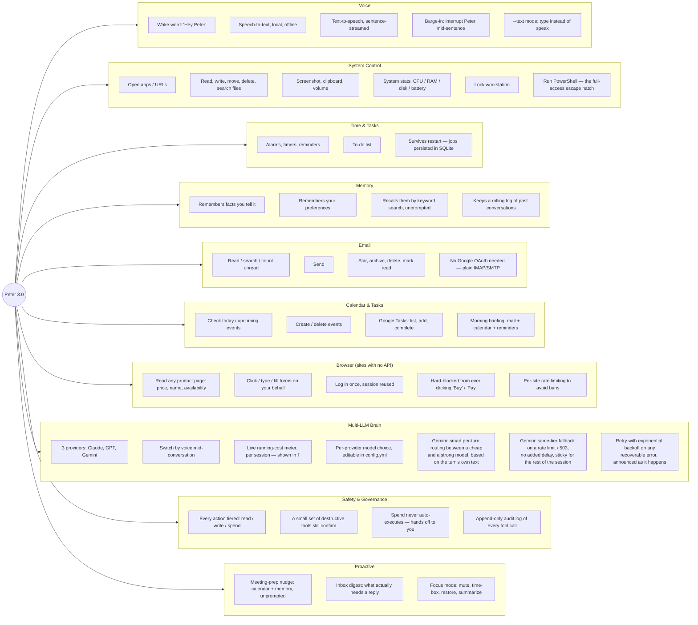

### 1.2 What each area means in practice

| Area | You can say... | What actually happens |
|---|---|---|
| **Voice** | "Hey Peter, what's the weather" | Wake word fires locally → speech is transcribed on-device (faster-whisper) → sent to the LLM → the reply is streamed to TTS sentence-by-sentence, so Peter starts talking before the full answer is even generated. |
| **System control** | "Take a screenshot" / "Open Chrome" / "What's my CPU doing" | Runs directly against Windows via `psutil`, `pywin32`, `pycaw`. `run_powershell` is the deliberate escape hatch for anything not covered by a named tool — always confirmed, always logged. |
| **Time & tasks** | "Remind me to stretch in 20 minutes" | Stored in a SQLite-backed APScheduler job. Survives a restart — kill the process, the reminder still fires later because the job lives on disk, not in memory. |
| **Memory** | "My college is PSG Tech" ... weeks later ... "which college am I in" | Facts and preferences are stored in SQLite with an FTS5 full-text index. Every turn, Peter's memory layer searches your new message for keyword overlap against stored facts and quietly injects the relevant ones — you never have to ask it to "remember to check its memory." |
| **Email** | "Any unread mail from my professor" | Reads over IMAP with an app password — no Google Cloud project, no OAuth, no weekly re-authorization. |
| **Calendar** | "What's on my calendar tomorrow" | Talks to Google Calendar/Tasks via a narrow OAuth client (sensitive, not restricted, scope — see §2.7). |
| **Browser** | "Check the price of this laptop on Flipkart" | No official API exists for that site (see README for the full API survey), so Peter drives a real, logged-in Playwright browser instead. It reads the page's own structured product data first (JSON-LD/OpenGraph — what Google Shopping reads), falling back to a screenshot only if that's absent. |
| **Multi-LLM** | "Switch to Gemini" | The whole conversation's tool-calling loop is vendor-neutral, so switching providers mid-session works without rewriting history — see §2.2.2. When Gemini is set to `auto` (this deployment's default), each turn's own text picks a cheap or a strong model with no extra API call — see §2.2.4. |
| **Safety** | "Delete this file" → Peter asks first, "open Notepad" → just runs | Every one of the 72 registered tools carries a permission tier at registration, but `write` now **defaults to running immediately** — only the handful of genuinely destructive/irreversible tools (delete, send, run a shell command, lock the workstation) are pulled back to confirm via `policy.standing_rules`. `spend`-class actions are not merely "asked about" — the code path to auto-execute them does not exist. See §2.4. |
| **Proactive** | (nothing — that's the point) | "Team meeting in 10 minutes, with Priya and Arjun" fires on its own from a calendar poll. "3 of your 23 unread look like they need a reply" fires from a mail poll. Both are read-only nudges, never actions taken on your behalf — see §2.10. |

### 1.3 What is deliberately **not** built yet

Being explicit about the boundary matters as much as the feature list:

- **No autonomous purchase completion.** Peter can fill a cart and reach the payment screen; RBI's mandatory two-factor authentication rules (from 1 April 2026) mean the OTP/UPI PIN step is legally yours, not automatable, so the code has no path that attempts it.
- **No live transport/seat-availability watchers yet** (Phase 4 — polling jobs for price/seat drops). The browser layer that would power them already exists.
- **No SMS / phone bridge** (Phase 6 — would need an Android companion app or ADB bridge; Windows has no API into your phone's messages).
- **No subagent fan-out** (Phase 7 — e.g. "check this product across 5 sites at once" in parallel). The current design is deliberately a single agent loop with ~72 tools, which is simpler to debug and sufficient for now.

---

## Part 2 — Technical Architecture

### 2.0 System overview

Peter is six layers, each independently testable. A voice turn flows straight
down through all of them and back up:

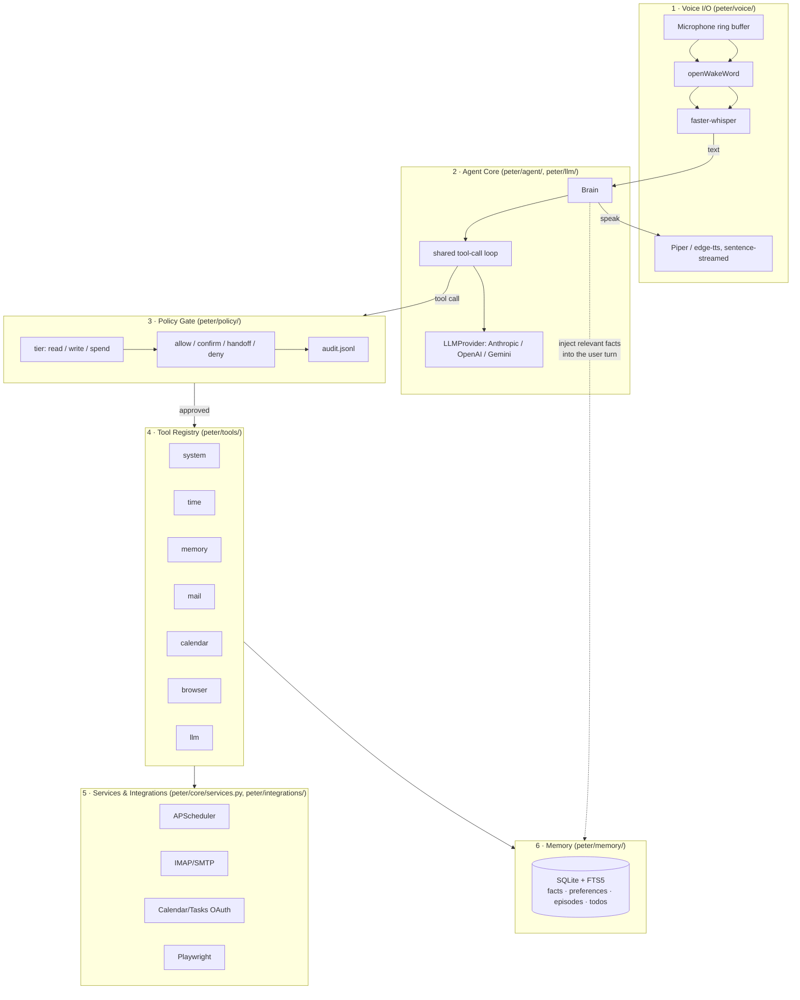

**Why this shape, not a "fleet of agents":** a single LLM loop with a large,
well-described tool registry outperforms a hand-wired multi-agent mesh for
this workload, and is far easier to debug and audit. Each layer below is
independently unit-tested; the plan explicitly reserves real subagents for
later, for genuinely parallel work (e.g. reading five product pages at once)
where a single context window would get flooded.

---

### 2.1 Voice I/O — `peter/voice/`

**Job:** turn "someone is talking near the mic" into text, and turn Peter's
reply back into audio, without ever blocking on network for the listening
part.

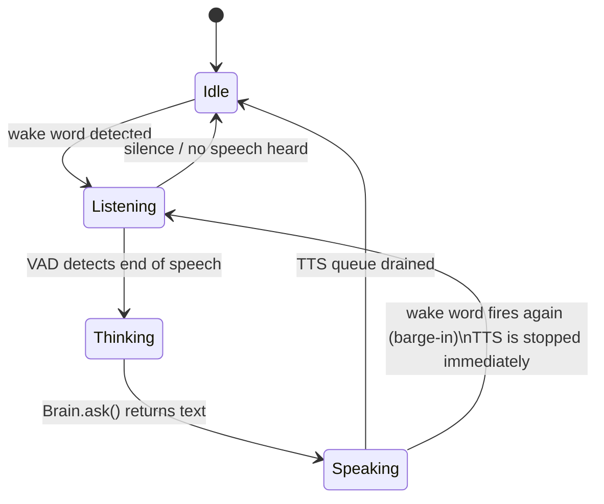

- **Wake word** (`wake.py`): `openWakeWord` running on `onnxruntime`, fully
  local. No audio leaves the machine until "Hey Peter" is detected — this is
  a hard privacy property, not a performance optimization, and is worth
  keeping even if a cloud wake-word engine were faster.
- **Speech-to-text** (`stt.py`): `faster-whisper`, endpointed by voice-activity
  detection so Peter knows when you've *stopped* talking rather than waiting
  for a fixed timeout.
- **Text-to-speech** (`tts.py`): the reply is **streamed and split into
  sentences** before being handed to the speech engine, so Peter starts
  speaking the first sentence while later ones are still being synthesized —
  this is what makes response latency feel like ~1s instead of "wait for the
  whole paragraph."
- **Barge-in**: `main.py`'s `_voice_tick()` checks the wake word *even while
  Peter is speaking*; hearing it mid-sentence calls `speaker.stop()` and
  immediately starts listening. An always-on assistant that can't be
  interrupted is unusable.
- **`--text` mode** exists specifically so every other layer can be developed
  and tested without a microphone, wake-word model, or TTS engine in the
  loop at all.

---

### 2.2 Agent Core — `peter/agent/brain.py` + `peter/llm/`

**Job:** decide what to say and which tools to call, on whichever LLM vendor
is currently active, without the rest of the codebase caring which vendor
that is.

#### 2.2.1 One turn, end to end

This is the sequence that runs on *every single* thing you say to Peter —
the most important diagram in this document:

```mermaid
sequenceDiagram
    participant U as You
    participant B as Brain.ask()
    participant L as loop.run_turn()
    participant P as LLMProvider (active vendor)
    participant G as PolicyGate
    participant R as Tool Registry
    participant Svc as Services / Memory

    U->>B: "remind me to call mom at 6"
    B->>B: build user turn:\n<now>...</now> + relevant memory + your text
    B->>L: run_turn(provider, tools, user_text, execute=Brain._execute)
    L->>P: add_user(text); complete(tools)
    P-->>L: response: tool_calls=[set_reminder(...)]
    loop for each tool call
        L->>B: execute(call)
        B->>R: registry.get_record("set_reminder")
        R->>G: gate.check(tool="set_reminder", tier="write")
        G-->>U: "Set a reminder for 6pm to call mom — ok?"
        U-->>G: yes
        G->>Svc: scheduler.add_once(...)
        Svc-->>G: job id
        G-->>R: allowed, result
        R-->>B: "Reminder set for 6:00 PM."
        B-->>L: ToolResult(content="Reminder set for 6:00 PM.")
    end
    L->>P: add_tool_results([...]); complete(tools)
    P-->>L: response: text="Done — I'll remind you at six."
    L-->>B: TurnResult(text, tool_calls, stop_reason)
    B-->>U: speaks the reply
```

Two details that are easy to miss and matter a lot:

- **The tool loop can go around more than once.** A single user turn may
  call several tools in sequence — check the calendar, *then* decide there's
  a conflict, *then* ask for confirmation to move an event. `loop.run_turn`
  caps this at `MAX_ITERATIONS = 12` so a confused model can't spend money
  in a circle.
- **`pause_turn` is a real stop reason, not an error.** Anthropic's
  server-side tools (web search/fetch) can pause a turn mid-flight; the loop
  detects `STOP_PAUSE` and re-sends to resume, up to
  `agent.max_pause_restarts` times, instead of silently returning a
  truncated answer.

#### 2.2.2 Why there are three vendor SDKs behind one interface

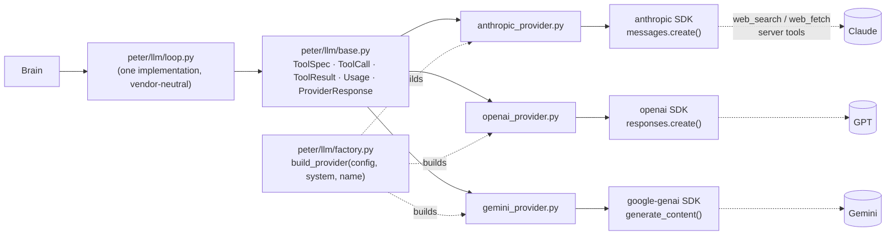

- Every vendor SDK ships its **own** auto-executing tool runner
  (`tool_runner` for Anthropic, implicit execution for OpenAI, `automatic_
  function_calling` for Gemini). All three are deliberately **not used** —
  each would run tool calls itself, bypassing the Policy Gate entirely. The
  shared `loop.py` is the only thing allowed to decide when a tool actually
  runs, and it always routes through `Brain._execute` → the registry → the
  gate.
- Each provider still has to translate the vendor's wire format into the
  shared `ToolCall` / `ToolResult` / `Usage` shapes, and each vendor has its
  own quirks the provider file absorbs so nothing above it has to know:
  OpenAI sends tool arguments as a JSON *string* that must be parsed;
  Gemini's function calls carry no call-id, so one is synthesized
  (`gemini-{index}-{name}`); OpenAI folds cached tokens *inside*
  `input_tokens` where Anthropic and Gemini report them separately, so
  `_usage()` normalizes that before it reaches the shared `Usage` type.
- **Switching provider keeps memory and cost, not conversation history.**
  The three vendors' conversation formats are structurally incompatible
  (Anthropic's content blocks vs. OpenAI's response items vs. Gemini's
  `Content`/`Part` tree), so `Brain.switch_provider()` starts a fresh
  provider-side history but carries the cumulative `Usage` total forward and
  re-injects memory on the next turn — the point of switching is usually
  "compare cost/quality," and that comparison needs the running total to
  survive.

#### 2.2.3 Prompt caching — why the system prompt is frozen

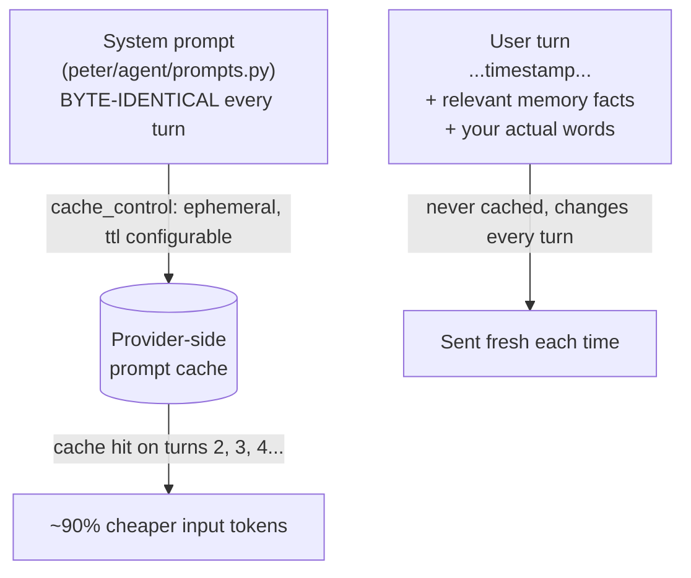

Prompt caching is a **prefix match**. The current time, today's date, or any
per-turn ID *must never* appear in the system prompt — putting it there would
silently invalidate the cache on every single turn and quietly multiply your
bill. That's why `Brain._build_user_content()` puts `<now>...</now>` and the
memory block in the *user* turn instead, keeping the system prompt frozen so
`usage.cache_read` stays non-zero from the second turn onward.

#### 2.2.4 Gemini: smart routing, same-tier fallback, and explicit caching — `peter/llm/router.py`, `peter/llm/providers/gemini_provider.py`, `peter/core/retry.py`

**Job:** when `agent.models.gemini` is set to `auto`, spend the strong model's
money only on turns that actually need it, survive Gemini being briefly
overloaded without adding real delay, and never let either of those things
quietly break prompt caching.

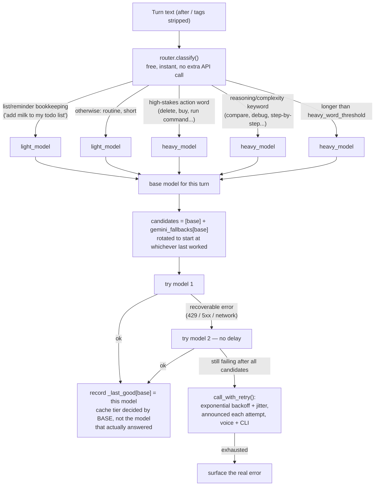

- **The router is a free heuristic, not an LLM call.** `classify()` runs a
  handful of regexes against the turn's own text — checked in a specific
  order, because order is where this went wrong twice in testing: bare
  words like "why" or "explain" matched so much ordinary conversation that
  *most* turns escalated to the expensive model, which is the opposite of
  the goal; then "add buy milk to my todo list" escalated because "buy"
  appeared inside the todo item's own text. The fix was checking list/
  reminder bookkeeping **first** (an unconditional escape to the cheap
  tier) and requiring genuine complexity phrases rather than single common
  words for everything after it.
- **Same-tier fallback is a fast hedge, not the backoff.** `gemini_fallbacks`
  in config.yml maps a model to same-*price* substitutes
  (`gemini-3.7-flash → gemini-3.6-flash → gemini-3.5-flash`), tried
  immediately with zero delay between them — this is what covers "one
  specific model is briefly overloaded." The exponential backoff below it
  only engages once every candidate in that list has also failed, which
  means the whole deployment (not just one model) is actually down.
- **Fallback is sticky.** `_last_good[base]` remembers which candidate
  worked last, so once a session has fallen over to `gemini-3.6-flash` it
  starts there next turn instead of re-probing the dead primary every
  single time — cheap to check, and it's what keeps "no added delay" true
  across a whole session, not just the first retry.
- **Caching has to key off the *routed tier*, not the model that actually
  answered — this was a real bug, found by testing the fallback live.**
  `_should_cache()` originally compared `self.model` to `auto_light_model`
  literally; once a session fell back to `gemini-3.6-flash`, that
  comparison went permanently false and silently disabled caching — and
  its ~90% saving — for the rest of the session, even though 3.6-flash is
  the same price tier and equally cacheable. Fixed by tracking
  `self._current_base` (the tier the router picked, set once per turn
  before any fallback rotation) and comparing *that* instead.
- **The heavy tier is never cached.** Caching only applies to the light
  model — the heavy model is used rarely enough per session that paying to
  *create* a cache for it would cost more than it saves.
- **Retry announces itself, in both voice and text.** `call_with_retry()`
  (used for the outer backoff, and by anything else in the codebase that
  needs the same shape) takes an `on_retry` callback; `Brain._on_retry`
  speaks "Gemini isn't responding (attempt 2 of 5). Retrying in 20
  seconds..." through `services().say()` — so a real outage is narrated,
  not silent, in whichever mode you're in.
- **Cost displays in ₹, not $.** Every vendor bills in USD; `Usage.summary()`
  converts using `agent.usd_to_inr_rate` (a manually maintained rate, no
  live FX feed) only at display time — the underlying `cost_usd` totals stay
  in USD, since that's what every pricing table in `pricing.py` is
  denominated in.

---

### 2.3 Tool Registry — `peter/agent/registry.py` + `peter/tools/`

**Job:** turn a plain Python function into something an LLM can discover,
understand, and call — for all three vendors, from one definition.

```mermaid
flowchart LR
    Fn["def set_reminder(text: str, at_iso: str) -> str:\n    '''docstring the model reads'''"]
    Deco["@peter_tool(tier='write')"]
    Fn --> Deco
    Deco --> Wrapped["ToolRecord\n(sdk_tool, tier, name)"]
    Wrapped --> Schema["ToolSpec\n(name, description, JSON-Schema parameters)\nvia Anthropic beta_tool inference"]
    Schema --> A2[Anthropic tools=[...]]
    Schema --> O2["OpenAI tools=[...] (parameters key)"]
    Schema --> G2["Gemini function_declarations=[...] (parameters_json_schema)"]
```

- **One decorator, three vendors.** `@peter_tool(tier=...)` wraps the
  function once; the Anthropic SDK's schema-inference (from type hints +
  docstring) is reused as the JSON-Schema engine for *all three* providers —
  not because Anthropic is privileged, but because it's already correct and
  rewriting signature→schema inference three times would just be three
  chances to get it wrong differently.
- **Tool order is part of the cached prefix.** `tool_specs()` returns tools
  in a stable, sorted order deliberately — a registry that reordered itself
  between runs would invalidate the prompt cache for no reason.
- **72 tools currently registered**, split by permission tier:

| Module | Read | Write | What it covers |
|---|---:|---:|---|
| `system.py` | 6 | 9 | apps, files, clipboard, volume, screenshot, stats, lock, PowerShell |
| `mail_tools.py` | 5 | 5 | read/search/send/star/archive/delete + inbox_digest triage |
| `time_tools.py` | 3 | 6 | alarms, timers, reminders, to-dos |
| `calendar_tools.py` | 4 | 4 | events + Google Tasks |
| `browser_tools.py` | 5 | 4 | read/click/type/login on sites with no API |
| `desktop_tools.py` | 2 | 6 | apps, bookmarks, YouTube, media keys, local folders |
| `memory_tools.py` | 2 | 4 | facts + preferences |
| `focus_tools.py` | 1 | 2 | timed mute-and-restore focus sessions |
| `briefing_tools.py` | 2 | 0 | morning briefing status |
| `llm_tools.py` | 1 | 1 | switch / inspect provider |
| **Total** | **31** | **41** | |

  Notice there is no `spend` tier in this table — see §2.6, that boundary is
  enforced structurally in the browser layer, not by a tool flag that a
  mistake could flip.

---

### 2.4 Policy Gate — `peter/policy/gate.py`

**Job:** the one place every tool call passes through before its body runs.
Nothing calls a tool directly.

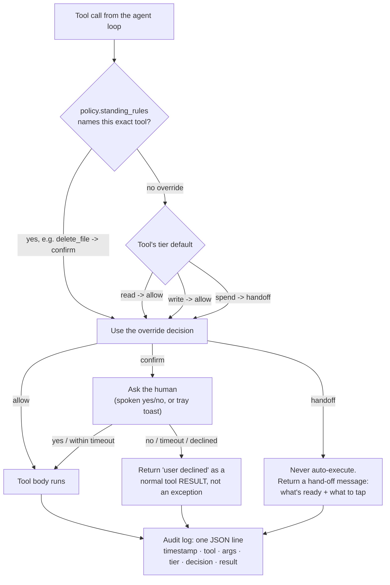

- **`write` defaults to `allow`, not `confirm`.** Early on, every write-tier
  tool prompted — opening an app, playing a video, adding a calendar event,
  all needed a spoken yes/no. In practice this trained the habit of
  reflexively saying "yes" to everything, which defeats the point of
  asking. The tier default flipped to `allow`; only tools in
  `policy.standing_rules` that are genuinely destructive or hard to
  reverse — `delete_file`, `delete_email`, `delete_calendar_event`,
  `run_powershell`, `lock_workstation`, `send_email` — are pulled back to
  `confirm`. `spend` still always hands off and never even reaches a
  prompt.
- **Per-tool overrides beat the tier default in *either* direction** —
  `standing_rules` can loosen a tool (`set_reminder: allow` even though
  reminders aren't literally read-tier) or tighten one (the destructive list
  above), all from `config.yml` with no code change.
- **A decline is a tool *result*, not a raised exception.** If it raised,
  the whole turn would abort and the user would hear nothing but a
  generic error. Returning it as text means the model sees "the user
  declined" and can react naturally — apologize, offer an alternative, ask
  what to do instead.
- **Fails closed.** The default confirmer when nothing else is wired up
  (`AlwaysDeny`) refuses everything rather than allowing it. A Peter that's
  annoyingly cautious is a nuisance; one that silently allows destructive
  actions because no confirmer was configured is a disaster.
- **Every decision is audited**, approved or not — `data/audit.jsonl` is the
  forensic trail for "why did Peter do that."

---

### 2.5 Memory — `peter/memory/store.py`

**Job:** remember things across restarts, and surface the *relevant* ones
without being asked.

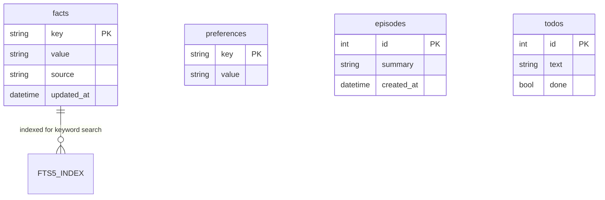

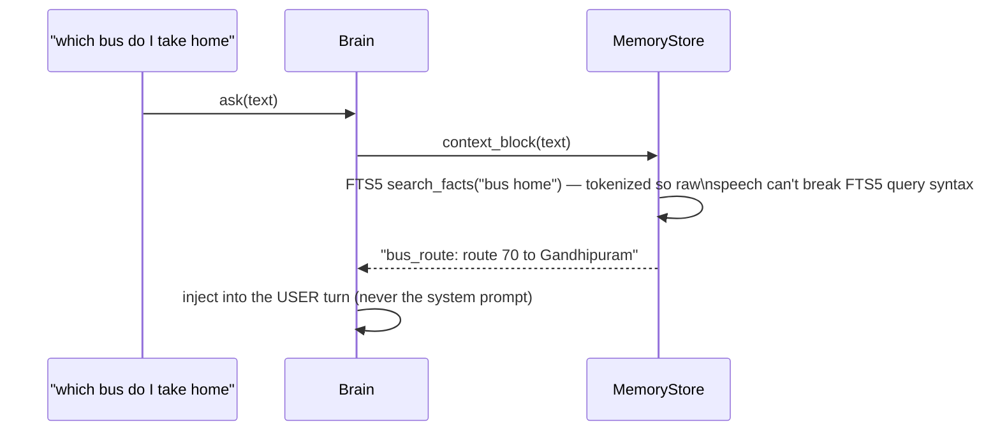

- **SQLite + FTS5**, four tables: `facts` (durable statements about you),
  `preferences` (how Peter should *behave* — e.g. "keep replies under two
  sentences"), `episodes` (rolling conversation summaries), `todos`.
- **Recall is automatic, not a tool the model has to remember to call.**
  Every turn, `Brain._build_user_content()` runs a keyword search over your
  message and silently prepends whatever facts share a token with it — the
  bus-route example above only works because "bus" appears in both the
  stored key's value and your question.
- Speech is tokenized before it reaches FTS5's query parser specifically
  because raw transcribed speech can contain characters (quotes, hyphens,
  stray punctuation) that are meaningful *syntax* to FTS5's query language —
  an untokenized query can outright fail to parse.

---

### 2.6 Browser Automation — `peter/integrations/browser/`

**Job:** the only way to interact with the sites that have no API at all
(Blinkit, Zepto, Myntra, Meesho, Swiggy, Zomato, most of Flipkart) — while
never being able to spend money and never getting the whole session banned.

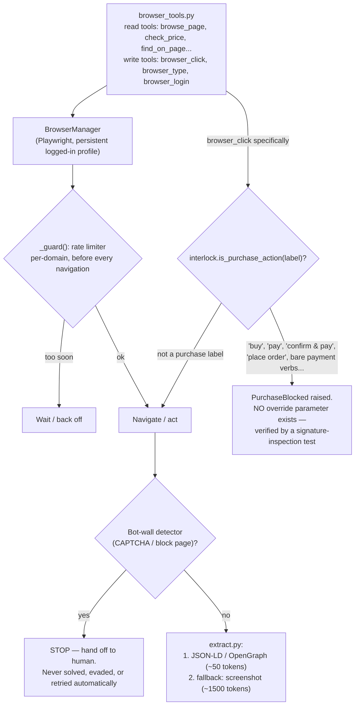

- **Structured data first, screenshots last.** Almost every commerce page
  already publishes JSON-LD/OpenGraph product data for Google Shopping to
  read — price, name, availability, brand. Reading *that* costs roughly 50
  tokens; a screenshot costs roughly 1,500. Screenshots are the fallback
  when structured data is genuinely absent, not the default.
- **Per-domain rate limiting is the primary anti-ban strategy** — more
  effective in practice than trying to out-fingerprint commercial bot
  detection (Akamai/PerimeterX/Cloudflare all run on these sites). A
  persistent, real, headed browser profile with genuine cookies plus slow,
  human-paced polling avoids most of what would otherwise get an account
  suspended.
- **A bot-wall (CAPTCHA, block page) is a stop signal, never a puzzle.**
  `detect.py` exists to *recognize* that state and hand off to you, not to
  solve it.
- **The purchase interlock has no bypass parameter, on purpose.** This
  isn't "ask before buying" — the function that would complete a purchase
  simply doesn't exist in a callable form. `guard()` takes only a label to
  check, and a dedicated test inspects the function's *signature* to assert
  no override argument was ever added back in by accident.  This is the
  code-level enforcement of RBI's mandatory-2FA rule from §1.3: even if the
  policy gate were somehow bypassed, this layer still can't complete a
  payment.
- Nine tools total, split precisely because a single `browse_and_extract`
  tool can't carry one permission tier: reading is `read`, clicking/typing
  is `write`, and "place order" isn't a *tier* at all — it's structurally
  unreachable.

---

### 2.6b Desktop control — `peter/integrations/desktop/`

**Job:** drive the software already installed on the machine — your own
browser, its bookmarks, whatever is playing, and local folders — from a spoken
request that never names anything exactly.

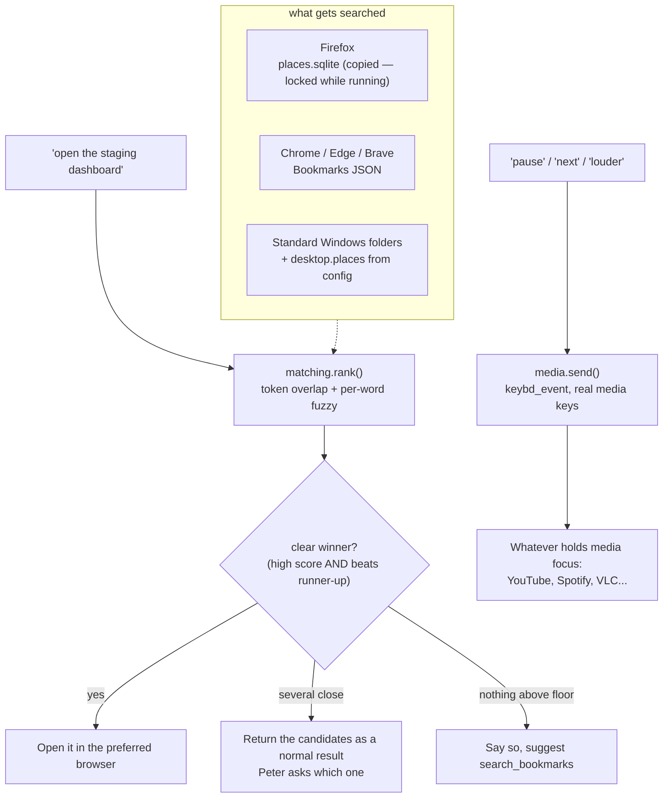

Four decisions worth knowing:

- **Ambiguity is a result, not a failure.** With 104 real bookmarks, "log
  search" genuinely matches four things. `rank()` only reports a confident
  winner when the top score is high *and* clears the runner-up by a margin;
  otherwise the tool returns the candidates and Peter asks. Silently opening
  one of four similar bookmarks is worse than one short question.
- **Character similarity cannot carry a match on its own.** Found live:
  `"zzz nothing"` scores 0.44 against `"HDFC Net Banking"` on incidental
  shared letters. Fuzzy scoring is discounted by half unless at least one word
  actually overlaps — but per-*word* similarity is kept, so `"dashbord"` still
  finds `"dashboard"`, which is what a speech transcript really produces.
- **Firefox's bookmark database is copied before reading.** `places.sqlite` is
  locked exactly when you want it — while Firefox is open — so it is copied to
  temp and the copy is queried.
- **Playback uses real media keys, not page automation.** `keybd_event` with
  the same virtual keys as a media keyboard, so Windows routes them to whatever
  currently has media focus. Driving the YouTube page through Playwright would
  only work for YouTube, only in Peter's own browser instance, and would break
  whenever the markup changed.
- **YouTube can open in a different browser than everything else.**
  `desktop.youtube_browser` (e.g. Brave) overrides `preferred_browser`
  (e.g. Firefox) specifically for `youtube.com`/`youtu.be` URLs — checked
  once, in `_open_with_preferred()`, so it applies uniformly whether the
  video came from `play_youtube`, `open_named_site("youtube")`, or a
  YouTube bookmark. Left blank, there is no override and everything shares
  one browser as before.

YouTube search deserves its own note: the top result is found by fetching the
search page and reading the `"videoId"` fields out of the JSON embedded in its
HTML — no API key, no quota, no browser. It depends on an internal page format,
so it fails cleanly: if the pattern stops matching, the tool opens the search
results page instead of doing nothing.

### 2.7 Integrations — `peter/integrations/{mail,google}/` + `peter/core/services.py`

**Job:** everything networked and optional is built **lazily**, on first
use, and never blocks startup.

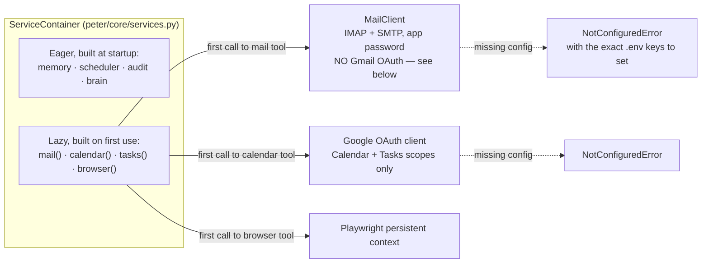

- **Why IMAP/SMTP instead of the Gmail API for mail:** a personal Google
  Cloud project in "Testing" status issues refresh tokens for Gmail's
  *restricted* scope that **expire after 7 days** — Peter would silently
  stop reading your email every week until manually re-authorized. Moving
  to "In Production" for a restricted scope requires a third-party Google
  security audit, unrealistic for a personal project. Plain IMAP with an
  app password sidesteps the OAuth trap entirely for reading mail, at the
  cost of losing Gmail's label/thread richness.
- **Calendar/Tasks stay on OAuth** because those scopes are only
  *sensitive*, not *restricted* — they don't carry the 7-day trap, so a
  narrow, separate OAuth client for just those two scopes is fine.
- **Constructing a client is deferred until the first tool call that needs
  it.** Building an IMAP connection at process startup would mean Peter
  refuses to boot when the wifi is briefly down, and adds seconds to launch
  for integrations a given session might never touch. `NotConfiguredError`
  carries the *exact* fix (which `.env` keys, which CLI flag) rather than a
  bare failure.
- `ServiceContainer.health()` (surfaced by `python -m peter.main --health`)
  walks every provider/integration and reports its real state — this is the
  single command that answers "is everything wired up correctly."

---

### 2.8 Scheduler — `peter/scheduler/jobs.py`

**Job:** alarms, timers, reminders, and the daily briefing must survive the
process being killed and restarted — a reminder that silently disappears on
a crash is worse than no reminder at all.

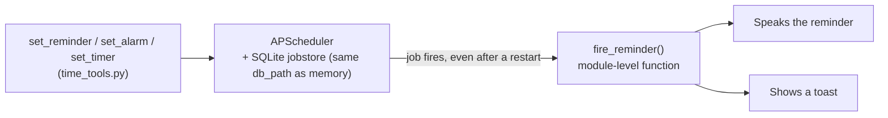

- **Job targets must be module-level functions**, never bound methods or
  lambdas — APScheduler serializes a job by its Python *import path* to
  survive a restart, and a bound method or lambda has no stable import path
  to serialize. This is why `fire_reminder()` is a free function, not a
  method on `Scheduler`.
- Alarms, timers, and reminders are three thin wrappers (`add_once`,
  `add_in`, `add_daily`) over the same underlying job store, so "survives
  restart" is one property proven once, not three times.

---

### 2.9 Supervisor loop — `peter/main.py`

**Job:** own every long-lived object, wire the layers together, and make
sure one bad turn never takes down the whole session.

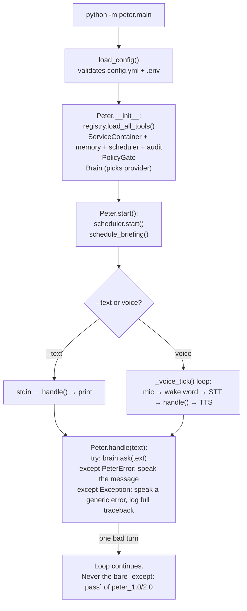

- **Every turn is isolated.** `handle()` catches both known (`PeterError`)
  and unknown exceptions, turns either into something speakable, and lets
  the *loop* continue — this directly replaces peter_1.0/2.0's single
  `except: pass` around the entire program, which either died silently or
  killed the whole assistant with no trace of why.
- **Nothing is a module-level global.** Every service is constructed in
  `Peter.__init__`, held in one `ServiceContainer`, and torn down in
  `shutdown()` — this is what makes the whole thing testable: tests build
  their own container and swap it in instead of fighting shared global
  state.
- `--health`, `--devices`, `--briefing`, `--google-auth` are all short-lived
  commands that build just enough of the container to answer the question
  and exit — they do not start the voice loop.

---

### 2.9b CLI status line — `peter/ui/progress.py`

**Job:** in `--text` mode, show *exactly* what a turn is doing at every
moment — not just "Peter is thinking" for the whole turn regardless of
whether it's calling zero tools or five — without any of that ever
corrupting the confirm prompt or a log line sharing the same terminal.

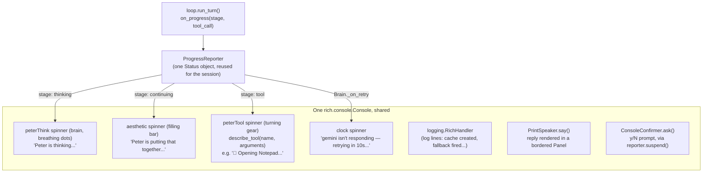

- **`describe_tool()` reads the tool call's actual arguments, not just its
  name.** A curated map of ~70 tools each carry an emoji + template
  (`open_app` → `"🚀 Opening {name}"`), filled in from the call's own
  arguments — so the status line says *what* is being opened/sent/deleted,
  not just that something is happening. Any tool not in the map still gets
  a readable fallback (humanized snake_case), so a newly added tool never
  breaks this.
- **The branded spinners are registered into Rich's own spinner table**
  (`rich.spinner.SPINNERS["peterThink"] = {...}`), not vendored — a plain
  dict mutation at import time, keyed by frames of equal length so the
  status line doesn't jitter sideways as it animates (a real failure mode
  of naive emoji-cycling spinners).
- **One Console, shared by the spinner, the logger, and replies — this was
  a real, found-live bug, not a hypothetical.** `RichHandler` originally
  opened its *own* `Console`; two independent writers issuing ANSI redraw
  codes to the same terminal is exactly what produced garbled output like
  `⢃⠨ 🧠 Peter is thinking...[18:09:25] INFO prompt cache created...` on one
  line. `main()` now builds a single `Console` and threads it through
  `configure_logging(console=...)` and `Peter(console=...)`, which is what
  lets Rich suspend-and-redraw correctly around a log line instead of the
  two colliding.
- **Replies render in a bordered `Panel`, not a bare `print()`.** Fixes the
  same class of problem from a different angle: a multi-fact answer ("CPU
  is X, memory is Y, disk is Z...") used to print as one line mixed into
  the log stream; a Panel visually separates it. Along the way this caught
  a second, unrelated Rich landmine: `"[peter]"` looks exactly like markup
  (a style tag named "peter"), so printing it unescaped silently vanished
  instead of showing — worth knowing if any other literal-bracket text ever
  needs to go through this console.
- **The confirm prompt suspends the spinner for exactly its own duration**,
  via an injectable `suspend()` context manager on `ConsoleConfirmer`
  (`reporter.suspend`) — a spinner still animating while `input()` reads
  stdin mangles both the `[y/N]` text and whatever gets typed in response.
  Suspending only around the prompt, not the whole turn, means a turn with
  several confirmations in a row still shows the spinner between them.

---

### 2.10 Proactive features — `peter/meeting_prep.py`, `peter/inbox_digest.py`, `peter/focus.py`

**Job:** speak up without being asked, without ever taking an action that
matters on your behalf and without becoming a nag once it has already said
something.

```mermaid
flowchart TD
    subgraph MP["Meeting prep — poll every lead_minutes/2"]
        MPoll["check_meeting_prep()\nlist_events(now, now+lead_minutes)"] --> MDedup{"event.id already\nannounced?"}
        MDedup -->|no| MNote["memory.related_note(summary + attendees)"]
        MNote --> MSpeak["say(...) + toast"]
        MDedup -->|yes| MSkip[skip]
    end

    subgraph ID["Inbox digest — poll every poll_interval_minutes"]
        IPoll["check_inbox_digest()\ncount_unread() + list_messages(UNSEEN)"] --> IClassify["one-shot model call:\nsender/subject list -> which need a reply"]
        IClassify --> IChanged{"unread count changed\nsince last announcement?"}
        IChanged -->|yes| ISpeak["say(...) + toast"]
        IChanged -->|no| ISkip[skip — do not nag]
    end

    subgraph FM["Focus mode — on demand"]
        FStart["start_focus_session(minutes, label)"] --> FMute["volume.get() -> mute to 0"]
        FMute --> FSchedule["scheduler.add_one_off_job\nargs=[previous_volume, label, started_at]"]
        FSchedule -->|timer fires, even after a restart| FRestore["complete_focus_session()\nrestore volume + log episode + say(...)"]
        FStart -.->|or end_focus_session()| FRestore
    end
```

- **Meeting prep and the inbox digest both poll rather than pre-schedule.**
  A calendar event can be moved or cancelled, and new mail arrives
  continuously — a job scheduled once, in advance, would be checking a fact
  that may no longer be true by the time it fires. Polling re-reads the
  live state every time instead.
- **Dedup is what keeps "proactive" from becoming "annoying."** Meeting prep
  remembers which event ids it has already announced (pruned after 24h); the
  inbox digest remembers the last unread count it spoke and stays quiet
  until that number actually changes. Both dedup stores are in-process only
  — lost on a restart, which just risks one repeated nudge, never a missed
  one.
- **The inbox digest's classification is a real model call, deliberately
  small.** A keyword heuristic cannot tell an HR reminder from a production
  incident; a full conversational turn would cost far more than the task
  needs. `factory.build_provider()` builds a fresh, tool-free provider
  against a plain numbered sender/subject list (never message bodies) using
  whichever vendor is already configured — the same function that builds
  the main conversation's provider, just pointed at a one-shot prompt
  instead. On any failure it degrades to reporting the bare unread count,
  never to drafting or sending anything; it is read-only by construction,
  not by convention.
- **Focus mode's restore survives a restart because the value to restore is
  baked into the scheduled job's own arguments**, in the same persistent
  SQLite jobstore reminders use (§2.8). The in-process `_active` state that
  backs `focus_status()` and an early `end_focus_session()` does *not*
  survive a restart — only the actual system-level restore does, which is
  the half that actually matters.

---

## Appendix — file map

```
peter_3.0/
├── config/config.yml         # everything non-secret, committed
├── .env                      # secrets only, gitignored
├── peter/
│   ├── main.py                # §2.9 supervisor loop
│   ├── agent/
│   │   ├── brain.py            # §2.2 turn orchestration
│   │   ├── prompts.py          # §2.2.3 frozen system prompt
│   │   └── registry.py         # §2.3 @peter_tool → schema + tier
│   ├── llm/
│   │   ├── loop.py              # §2.2.1 the one shared tool-call loop
│   │   ├── base.py              # vendor-neutral types
│   │   ├── factory.py           # picks + builds the active provider
│   │   ├── pricing.py           # $/Mtok table, cost estimation
│   │   ├── router.py            # §2.2.4 light/heavy classification (Gemini auto)
│   │   └── providers/           # §2.2.2 anthropic / openai / gemini
│   │       └── gemini_provider.py  # §2.2.4 auto-routing, fallback, explicit cache
│   ├── policy/
│   │   ├── gate.py               # §2.4 allow / confirm / handoff / deny
│   │   └── audit.py              # append-only JSONL trail
│   ├── tools/                   # §2.3 the 72 registered tools
│   ├── memory/store.py          # §2.5 SQLite + FTS5
│   ├── scheduler/jobs.py        # §2.8 APScheduler + SQLite jobstore
│   ├── meeting_prep.py          # §2.10 calendar + memory nudge
│   ├── inbox_digest.py          # §2.10 read-only "needs a reply" scan
│   ├── focus.py                 # §2.10 mute / time-box / restore
│   ├── ui/
│   │   ├── progress.py           # §2.9b CLI status line, branded spinners
│   │   ├── confirm.py            # voice-mode spoken yes/no confirmer
│   │   └── tray.py               # pystray icon, mic-state, confirm toasts
│   ├── integrations/
│   │   ├── mail/                 # §2.7 IMAP/SMTP
│   │   ├── google/               # §2.7 Calendar/Tasks OAuth
│   │   ├── browser/              # §2.6 Playwright + purchase interlock
│   │   └── desktop/              # §2.6b apps, bookmarks, YouTube, media, folders
│   │       ├── browsers.py        # open_url + bookmark reading (Firefox/Chromium)
│   │       ├── matching.py        # fuzzy rank() for "open the staging dashboard"
│   │       ├── media.py           # real media-key events
│   │       ├── places.py          # standard Windows folders + configured ones
│   │       ├── youtube.py         # top-result search, no API key
│   │       └── volume.py          # §2.10 pycaw get/set, shared by focus mode
│   ├── voice/                   # §2.1 wake / stt / tts / audio
│   └── core/
│       ├── config.py             # config.yml + .env loader/validator
│       ├── services.py           # the lazy ServiceContainer
│       ├── errors.py             # PeterError hierarchy
│       ├── logging.py            # literal-value secret redaction, shared Console
│       ├── retry.py              # §2.2.4 call_with_retry: backoff + jitter
│       └── notify.py             # desktop toast, shared by reminders/proactive features
└── tests/                     # one test file per subsystem above
```
