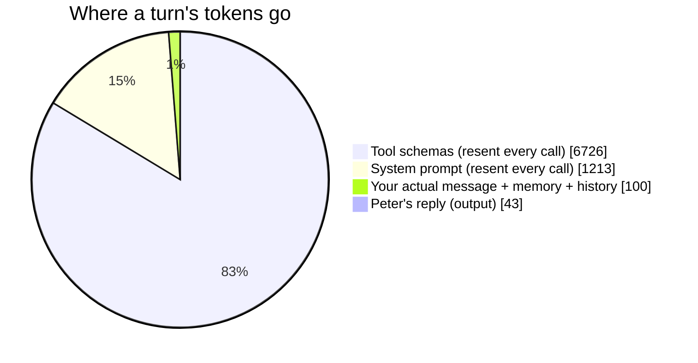
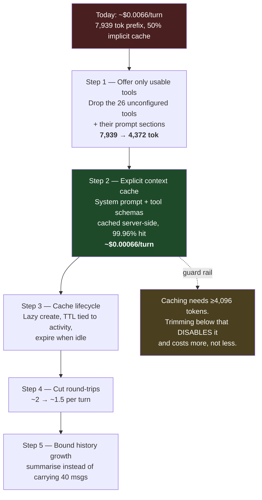

# Peter 3.0 — LLM Cost Reduction Plan

**Goal:** cut API cost as far as it will go **without losing accuracy**.

Everything below is measured against the live Gemini API on 19 Aug 2026, not
estimated. Where a number is a projection it says so.

---

## 1. Where the money actually goes

The first useful finding is that almost none of it goes where you'd guess.

| Measured, live | Value |
|---|---|
| Input tokens, 4-turn session | 62,462 |
| Output tokens, same session | 171 |
| **Output share of all tokens** | **0.3 %** |
| Fixed prefix sent on *every* request | **7,939 tokens** |
| — of which: tool schemas (60 tools, at time of measurement) | 6,726 tok (85 %) |
| — of which: system prompt | ~1,100–1,450 tok (15 %) |
| API round-trips per conversational turn | ~2 |



**The conclusion that drives this whole plan:** output tokens are a rounding
error. Peter's cost is ~99.7 % *input*, and ~98 % of that input is the same
fixed prefix re-sent on every single API call. Optimising how Peter *answers*
is pointless. The only thing that matters is what gets re-sent, and how often.

Two multipliers make it worse:

- **~2 round-trips per turn.** A turn that calls a tool pays the full prefix
  twice — once to decide the call, once to read the result and answer.
- **The prefix is barely cached today** (see §2).

---

## 2. The caching finding

Gemini has two caching modes. Peter currently uses neither deliberately — it
only *reads* the cache counter. I tested both against the live API.

**Implicit caching** (what Peter accidentally gets today), 4 identical
back-to-back calls:

| Call | Prompt tokens | Cached |
|---|---|---|
| 1 | 7,939 | **0** |
| 2 | 7,939 | **0** |
| 3 | 7,939 | 3,958 |
| 4 | 7,939 | 3,958 |

Two cold calls before it warms up, then it caches only **50 %** of the prefix.

**Explicit caching** (`client.caches.create` holding the system instruction +
all 60 tool declarations):

| Call | Prompt tokens | Cached |
|---|---|---|
| 1 | 7,939 | **7,936** |
| 2 | 7,939 | **7,936** |

**99.96 % coverage, from the very first call, no warm-up.** This is the single
biggest lever available, and it changes nothing about what the model sees — the
content is byte-identical, just stored server-side. **Zero accuracy risk.**

### The economics, including storage

Gemini 3.7 Flash: input $0.75/Mtok · cached input $0.075/Mtok · cache storage
$0.50/Mtok/hour.

| Mode | Cost per API call |
|---|---|
| Cold / uncached | $0.005954 |
| Implicit, warm (today) | $0.003283 |
| **Explicit cache** | **$0.000597** |

Storage for a 7,936-token cache is $0.0040/hour. Against $0.002686 saved per
call, it **breaks even at ~1.5 calls per hour** — well under one conversational
turn. During any active use it pays for itself many times over.

> **But it must not be held while idle.** Left running 24/7 with no traffic, the
> cache costs ~$0.095/day for nothing. The cache has to be created lazily on
> first use and allowed to expire when Peter goes quiet. That lifecycle *is*
> part of the work, not an afterthought.

---

> **Status: all five steps implemented.** §5 carries the measured outcome and
> §7 records one place the original projection in this document was wrong.

## 3. The dead weight finding

Peter currently ships **60 tool schemas on every request**. But mail, Google
Calendar/Tasks, and the browser are **not configured** — they have no
credentials, so those tools cannot succeed if called.

| Tool group | Tools | Tokens/request | Usable today? |
|---|---:|---:|---|
| core (system, time, memory, llm) | 34 | 3,298 | yes |
| mail | 9 | 1,033 | **no — no credentials** |
| calendar / tasks | 8 | 941 | **no — no credentials** |
| browser | 9 | 1,104 | **no — not logged in** |

Plus the matching system-prompt sections: "Email and calendar" (172 tok) and
"Browsing" (317 tok).

**3,567 tokens — 45 % of the entire prefix — describes capabilities Peter
physically cannot use right now**, paid for on every single API call.

Removing them is not a quality trade-off. It is *better* than neutral: today the
model can pick a mail tool, have it fail, and burn a whole extra round-trip
discovering what the prefix could have told it. A tool that cannot work is worse
than a tool that isn't offered.

---

## 4. The plan



### Step 1 — Offer only the tools that can actually work
*Saving: ~45 % of the prefix. Accuracy: neutral-to-positive.*

At startup, filter the registry by what is actually configured — if
`secrets.has_mail` is false, mail tools are not registered. Keep one line in the
system prompt so Peter can still say "email isn't set up yet" rather than being
mystified. Re-check on config change, not per turn, so the prefix stays stable.

### Step 2 — Explicit context caching on the light model
*Saving: ~82 % of what remains. Accuracy: zero risk — identical content.*

`GeminiProvider` creates a `CachedContent` holding the system instruction and
tool declarations, then passes `cached_content=` instead of re-sending them.

**Light model only.** Pro storage is $4.50/Mtok/hour (9× flash) and pro is used
rarely by design, so a persistent pro cache would lose money — pro keeps using
implicit caching.

### Step 3 — Cache lifecycle
*Prevents the optimisation from becoming a cost of its own.*

Create lazily on first turn; TTL a bit longer than a typical gap between turns;
refresh on use; let it lapse when idle. Must also invalidate whenever the
prefix legitimately changes — a config edit, an integration being set up, or a
tool being added — or Peter would silently run against a stale tool list.

### Step 4 — Cut round-trips per turn
*Saving: linear. Accuracy: needs care.*

~2 calls per turn today. Encouraging the model to batch independent tool calls
into one response cuts this. Worth measuring per-turn before and after; back it
out if answers get worse.

### Step 5 — Bound conversation growth
*Saving: only on long sessions. Accuracy: needs care.*

`max_history_messages: 40` is generous, and history is the one part of the
request that **cannot** be cached — it changes every turn. Rolling summarisation
of older turns keeps the tail bounded. Lowest priority: it only bites in long
sessions, and it is the change most likely to cost accuracy.

### Explicitly **not** doing: trimming tool descriptions

Tool docstrings are exactly how the model decides which tool to call, so
shortening them trades directly against accuracy — the one thing this plan is
not allowed to spend. And once Step 2 lands they are cached at 10 % of list
price, so squeezing them returns a tenth of what it appears to.

---

## 5. Measured outcome

| Stage | Tools | Prefix | Cost per API call | vs before |
|---|---:|---:|---:|---|
| Before | 60 | 7,939 tok | $0.003283 | — |
| After Step 1 | 43 | 5,705 tok | $0.002353 | −28 % |
| **After Steps 2–3** | 43 | **5,660 cached** | **~$0.000429** | **−87 %** |

### Live, end to end

The session usage counter, same workload before and after:

| | Before | After |
|---|---|---|
| Session line | `in 62,462 (cache r7,911) out 171` | `in 2,243 (cache r33,960) out 69` |
| Turns | 4 | 3 |
| **Input served from cache** | **11 %** | **93.8 %** |
| Session cost | $0.0481 | $0.0045 |
| **Cost per turn** | **$0.01203** | **$0.00150** |

```
gemini/gemini-3.7-flash | 43 tools | 3 job(s) scheduled
prompt cache created for gemini-3.7-flash (5660 tokens, ttl 900s)
```

**~8× cheaper per turn, with no accuracy cost** — and that understates it,
because the "after" run happened during a Gemini outage and included a dozen
retried calls the "before" run did not. Storage for the 5,660-token cache is
$0.00283/hour, pays for itself after ~1.5 calls, and is released at shutdown.

Steps 4–5 are worth having but are small by comparison — Step 4 removes
round-trips (each one previously paid a full prefix), and Step 5 only matters
in long sessions.

**One thing worth watching afterwards:** once flash turns are cached, an
escalation to `gemini-3.1-pro-preview` costs ~$0.0159 uncached — roughly **24×
a cached flash turn**. After this work, routing discipline becomes the dominant
marginal cost, so the router's escalation rate is worth keeping an eye on.

---

## 6. Guard rails

- **Do not trim below 4,096 tokens.** That is Gemini's minimum for caching to
  engage at all. Step 1 lands at 4,372 — deliberately just above it. Trimming
  further would disable caching and make the system *more* expensive.
- **The cache must invalidate when the prefix changes**, or Peter runs against
  a stale tool list — a correctness bug, not just a cost one.
- **Never hold a cache while idle.**
- **Verify with the counter, not by assumption.** `usage.cache_read` on turn 2+
  is the proof; if it is 0, something upstream is voiding the prefix.

---

## 7. Where this document's own projection was wrong

§3 above claimed 26 tools (3,567 tokens) were dead weight, and §5 originally
projected a 4,372-token prefix. Implementation showed that was too aggressive
on one count.

**Browser tools were wrongly counted as unusable.** The reasoning was "not
logged in, so it cannot work" — but the browser layer genuinely works on public
pages without a saved login, which is most of what price checking needs. They
are 9 tools and ~1,100 tokens, and dropping them would have traded real
capability for tokens. They stayed.

So Step 1 removed 17 tools rather than 26, and the prefix landed at 5,705
tokens rather than 4,372 — a 28 % cut instead of 45 %. The rule that survived
is narrower than the one first written here, and better:

> Drop a tool only when it **cannot succeed** — no credentials, so every call
> is guaranteed to fail. Never drop one merely because it is used rarely.

The final saving is barely affected, because Step 2 does the heavy lifting: a
larger prefix cached at a tenth of list price still beats a smaller one sent at
full price. Had the aggressive version shipped, the prefix would have sat at
4,372 tokens — only 276 above Gemini's 4,096 caching floor, close enough that
removing one more tool would have silently disabled caching entirely and made
the system *more* expensive.

## 8. What to watch now

- **Escalation rate.** A heavy-model turn is uncached and runs ~$0.0113 —
  roughly **26× a cached light turn**. The router's threshold is now the single
  biggest lever on the bill.
- **`cache_read` on turn 2+.** If it is ever 0, something is voiding the
  prefix and every request is silently paying full price again.
- **Long sessions.** History cannot be cached. It is the only part of the
  request that grows without bound.
